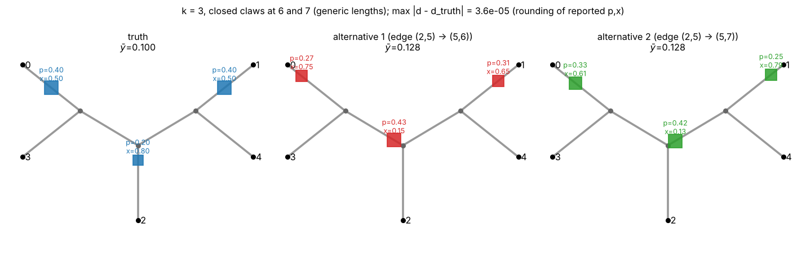
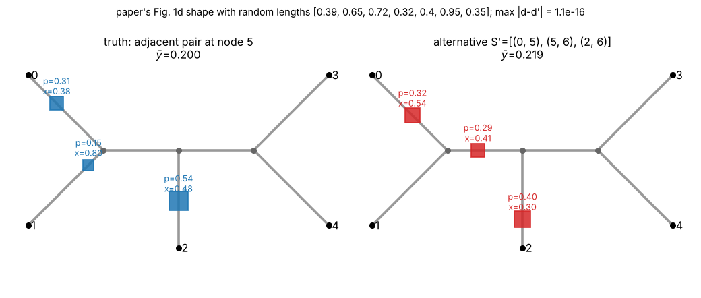
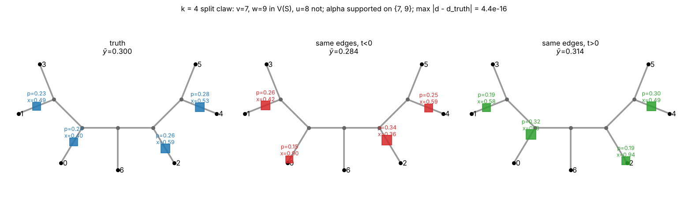

# Identifiability of phylogenetic distance deconvolution

*CS581 project, round 2 (theory). Extends `../decodiphy/REPORT.md` §3. Code: `code/`; figures: `figs/`;
exhaustive checks: `results/`.*

## 1. Setting and definitions

**Reference tree.** R is an unrooted binary tree with leaf set [n], node set V (|V| = 2n − 2), internal
nodes I (|I| = n − 2), and positive edge lengths l_e. d_R(·,·) is the path length. For a node v,
N(v) is its neighbour set and N[v] = N(v) ∪ {v}; for a set U, N[U] = ∪_{v∈U} N[v].

**PDD instance** (Arasti et al. 2026, Problem 1 with Assumption 1). A solution is
θ = (S, p, x, ȳ): a set S of k *distinct* edges of R, one query on each edge e_q = (a_q, b_q) at
distance x_q·l(e_q) from a_q, with 0 < x_q < 1, abundances p_q > 0 summing to 1, and mean pendant
length ȳ ≥ 0. Its mixture distance vector is d_r(θ) = Σ_q p_q d_R(r, π_q) + ȳ, where π_q is the attachment
point of query q; equivalently d(θ) = F m(θ) + ȳ·1 (Lemma 1). θ is **identifiable** if every θ' with |S'| ≤ |S| and d(θ') = d(θ)
equals θ. (Larger S' always exist when ȳ > 0, see C2 of the first report; only the minimal k is
meaningful, so the question is about k' ≤ k.)

**Placement shapes.** V(S) is the set of endpoints of S. S is a **matching** ("non-adjacent
placements") if no two edges of S share a node, so |V(S)| = 2k. A node v ∈ I is a **closed claw** of S
if N[v] ⊆ V(S). (Then v's S-partner is one neighbour and the other two neighbours are covered by two
more edges, so closed claws need k ≥ 3.)

**Laplacian.** F ∈ R^{n×V}, F_{r,v} = d_R(r, v). L is the weighted Laplacian with conductances 1/l_e:
(Lα)_u = Σ_{w∈N(u)} (α_u − α_w)/l_{uw}. For α ∈ R^I (extended by 0 on leaves) write
g = g(α) = −Lα, U = supp α, and T_U for the smallest subtree containing U.

## 2. The algebraic characterization (from round 1)

**Lemma 1 (barycentric reduction).** d(θ) = F m + ȳ·1 where the **node measure**
m = Σ_q p_q[(1 − x_q) δ_{a_q} + x_q δ_{b_q}] satisfies m ≥ 0, 1ᵀm = 1, supp m = V(S).

**Lemma 2 (kernel).** F(−Lδ_v) = (deg v − 2)·1 and 1ᵀLδ_v = 0 for every node v. For a binary tree,
the map (m, ȳ) ↦ (F m + ȳ 1, 1ᵀm) has kernel exactly span{(−Lδ_v, −1) : v ∈ I}.

**Theorem 1 (characterization).** d(θ) = d(θ') iff m' = m + g(α) and ȳ' = ȳ − Σ_v α_v for some
α ∈ R^I. Proofs: `../decodiphy/REPORT.md` §3 (and verified numerically, `../decodiphy/code/check_kernel.py`).

Consequently θ' is an alternative to θ iff there is α ∈ R^I with

* (Z) g_u = 0 for u ∉ V(S) ∪ V(S'),
* (N) g_u < 0 for u ∈ V(S) ∖ V(S')   (m'_u = 0 < m_u),
* (P) g_u > 0 for u ∈ V(S') ∖ V(S)   (m_u = 0 < m'_u),

(any sign on V(S) ∩ V(S')), plus the magnitude conditions m + g ≥ 0, ȳ − Σα ≥ 0. Since the sign
pattern is invariant under α ↦ tα, t > 0, and m, ȳ can be chosen freely, **"S' is an alternative to S
for some parameters" is exactly the feasibility of the sign pattern (Z, N, P)**. In particular every
negative entry of g is in V(S) and every positive entry is in V(S'). We use these two facts constantly.

## 3. Combinatorial lemmas

**Lemma 3 (unique realization).** If S is a matching and S' is a set of ≤ k edges with
V(S') = V(S), then S' = S. If moreover m' = m, then (p', x') = (p, x).
*Proof.* S' covers 2k nodes with ≤ k edges, so it is a perfect matching of the forest induced on V(S);
forests have at most one perfect matching (a leaf of the forest must be matched to its unique
neighbour; induct). Given the edges, p_q = m(a_q) + m(b_q), x_q = m(b_q)/p_q. ∎

**Lemma 4 (covering).** If X is a set of pairwise non-adjacent nodes contained in V(S), then |S| ≥ |X|.
*Proof.* An edge contains at most one node of X. ∎

**Lemma 5 (private neighbours).** Let α ≠ 0, U = supp α ⊆ I.
1. If |U| = 1, U = {v}: g_v = −α_v Σ_{w∈N(v)} 1/l_{vw}, g_w = α_v/l_{vw} for w ∈ N(v), and g = 0
   elsewhere. The three neighbours are pairwise non-adjacent.
2. If |U| ≥ 2, every leaf λ of T_U lies in U and has exactly two neighbours w, w' outside T_U (its
   **private pair**). Each has λ as its only neighbour in U, so g_w = α_λ/l_{λw} has the sign of α_λ.
   The private pair is non-adjacent, and private nodes of *different* leaves are non-adjacent.
3. If u ∈ U has degree 2 in T_U, its neighbour z outside T_U (its **private node**) has g_z = α_u/l_{uz}.
4. A node u ∉ T_U that is not adjacent to T_U has g_u = 0. For a private node w of λ, write C_w for the
   component of R − λ containing w; C_w ∩ T_U = ∅, and every node of C_w other than w has g = 0.

*Proof.* (1) is direct. (2): λ ∈ U because a leaf of the minimal spanning subtree is in U; λ is internal
(U ⊆ I), so it has 3 neighbours, one in T_U. If a private node w had another U-neighbour u, the path
λ–w–u would lie in T_U. The private pair are siblings (common neighbour λ), so they are not adjacent in
a tree. Private nodes w of λ and w'' of μ ≠ λ: if adjacent, λ–w–w''–μ is the λ–μ path, putting w in
T_U. (3), (4): same argument. ∎

The proofs below are case analyses on |U| and on the signs of α at the leaves of T_U: the private
pairs are forced into V(S) (negative) or V(S') (positive), and Lemma 4 counts the edges this costs.

## 4. Results for k ≤ 2

**Theorem 2 (k = 1).** Every θ with k = 1 is identifiable.
*Proof.* Let θ' have k' ≤ 1. If α = 0 then m' = m, supp m' = V(S) = {a, b}, so S' = S and
(p', x', ȳ') = (p, x, ȳ). If α ≠ 0: when |U| = 1, the three neighbours of v carry the same nonzero sign,
so they lie in V(S) or in V(S'), a pairwise non-adjacent triple inside a single edge: impossible.
When |U| ≥ 2, a private pair is a non-adjacent pair of the same sign inside one edge: impossible. ∎

**Theorem 3 (k = 2, complete).** Let S = {e_1, e_2} be two distinct edges.
1. **Non-adjacent placements:** θ is identifiable.
2. **Adjacent placements** e_1 = (a, v), e_2 = (v, b): the edge set S, the node measure m and ȳ are
   identifiable among all solutions with k' ≤ 2. (p, x) is not: the solutions are exactly
   p_1 = m_a + s, p_2 = m_b + (m_v − s), x measured from v: x_1 = m_a/p_1, x_2 = m_b/p_2, for
   s ∈ (0, m_v), an open 1-dimensional family that exists **for every parameter value**.

*Proof of (1).* Suppose θ' ≠ θ with |S'| ≤ 2. If α = 0 then m' = m and Lemma 3 gives θ' = θ. So
α ≠ 0.
* |U| = 1, U = {v}. If α_v > 0, the three neighbours of v are positive, so they lie in V(S'), and
  Lemma 4 needs 3 edges. If α_v < 0, they are negative, lie in V(S), and need 3 edges of S. Both are
  contradictions.
* |U| ≥ 2 and two leaves of T_U have the same sign. Their private pairs give 4 pairwise non-adjacent
  nodes, all in V(S') (positive) or all in V(S) (negative). Lemma 4 needs 4 edges.
* Otherwise T_U has exactly two leaves (it is a path λ … λ') with α_λ > 0 > α_λ'. Let w_1, w_2 be the
  private pair of λ (in V(S')) and w'_1, w'_2 that of λ' (in V(S)). Being non-adjacent, w'_1 and w'_2
  lie in different edges of the matching S, with partners a_1, a_2, and a_1 ≠ a_2, so one of them,
  say a_1, is not λ'. Then a_1 ∈ C_{w'_1} has g = 0 (Lemma 5.4) and m(a_1) > 0, so a_1 ∈ V(S'). Now S'
  (≤ 2 edges) must cover the pairwise non-adjacent nodes w_1 and w_2, so S' = {f_1 ∋ w_1, f_2 ∋ w_2} and
  V(S') ⊆ C_{w_1} ∪ C_{w_2} ∪ {λ}. That set is disjoint from C_{w'_1}, which contradicts a_1 ∈ V(S'). ∎

*Proof of (2).* V(S) = {a, v, b}. If α = 0 then supp m' = {a, v, b}, and the only cover of a–v–b by
≤ 2 tree edges with exactly these endpoints is S. So the edges are fixed, and the fibre is the split
of m_v between the two edges, as stated. Suppose α ≠ 0.
* |U| = 1: three pairwise non-adjacent nodes of one sign would have to lie in V(S'), which needs 3
  edges, or in {a, v, b}, which contains no such triple.
* Two same-sign leaves of T_U: 4 pairwise non-adjacent nodes in V(S') (4 edges) or in {a, v, b}.
  Impossible.
* Otherwise T_U is a path λ … λ' with α_λ > 0 > α_λ'. The negative private pair is a non-adjacent pair
  inside {a, v, b}, i.e. {a, b}, so λ' = v and a, b are v's off-path neighbours. The positive pair
  w_1, w_2 forces S' = {f_1 ∋ w_1, f_2 ∋ w_2} with V(S') ⊆ C_{w_1} ∪ C_{w_2} ∪ {λ}. An interior
  U-node's private node z (Lemma 5.3) cannot lie in V(S') (wrong component) nor in {a, v, b}, so
  U = {λ, v}. If λ is adjacent to v, then g_λ = (α_v − α_λ)/l − α_λ(1/l_{λw_1} + 1/l_{λw_2}) < 0, so
  λ ∈ V(S) = {a, v, b}: false. If the path has length 2 (λ–u_1–v), every neighbour of λ has α = 0, so
  g_λ < 0 and λ ∈ V(S): false. If it has length ≥ 3, its first interior node u_1 ∉ U has
  g_{u_1} = α_λ/l > 0, so u_1 ∈ V(S'): false (u_1 is in none of C_{w_1}, C_{w_2}, {λ}). ∎

**Relation to the paper.** Claim 3 / SB.3.4 shows the adjacency continuum (our Theorem 3(2) adds that
it holds for every parameter value, not a "corner condition", and that edges, m and ȳ stay
identifiable). SB.3.6 (Claim 5) proves, with the four-point condition, that the *edges* are
identifiable for k = 2 *when p_1 = p_2 = ½*. Theorem 3 removes the equal-p restriction, covers
(p, x, ȳ) and alternatives with k' = 1, and covers adjacent placements. To our knowledge no complete
k = 2 statement existed.

## 5. k = 3: closed claws are exactly the obstruction

**Theorem 4 (k = 3).** Let S be a matching of 3 edges. The following are equivalent:
- (A) for some parameters (p, x, ȳ) on S there is an exact alternative θ' ≠ θ with |S'| ≤ 3;
- (B) the parameters on S form a continuum (there is α ≠ 0 with supp g(α) ⊆ V(S));
- (C) S has a closed claw.

Moreover, if (C) holds then (i) every parameter value lies in a continuum, and (ii) on a nonempty
open set of parameters there is an exact alternative with a **different edge set** of the same size.

*Proof.* (C) ⇒ (B): α = δ_v for the claw centre v changes m only on N[v] ⊆ V(S). (B) ⇒ (A): take
θ' = θ moved by ±εα. Parts (i) and (ii) are Theorem 3 of the first report: decreasing α_v until
the neighbour u of v with the smallest m(u)·l_{uv} reaches mass 0 replaces the edge (v, u) by another
edge at v. This happens on an open set of parameters, namely whenever v's own S-partner is the
minimizer.

(A) ⇒ (C). Let θ' be an alternative with |S'| ≤ 3. If α = 0, Lemma 3 gives θ' = θ. So α ≠ 0.

*Case |U| = 1, U = {v}, α_v > 0.* N(v) = {n_1, n_2, n_3} are positive, so N(v) ⊆ V(S'). Also g_v < 0
and g = 0 elsewhere, so by (N), V(S) ∖ {v} ⊆ V(S'). Hence v ∈ V(S), with S-partner n_1 say. If
n_2, n_3 ∈ V(S), v is a closed claw. If neither is, then |V(S')| ≥ 5 + 2 > 6. If exactly n_2 ∉ V(S),
then V(S') = (V(S) ∖ {v}) ∪ {n_2} has 6 nodes and S' is a perfect matching of it. Write
S = {(v, n_1), (n_3, n'_3), (c, c')}. The S'-partners of n_1 and n_2 are neighbours of them in
V(S') ∖ {v}, so in C_{n_1} and C_{n_2} respectively. The only candidates are c, c' (n'_3 ∈ C_{n_3}).
But c and c' are adjacent and not v, so they lie in one component: contradiction.

*Case |U| = 1, α_v < 0.* N(v) is negative, so N(v) ⊆ V(S), and by Lemma 4 the three neighbours lie in
the three different edges (n_j, a_j) of S. If some a_j = v, then v ∈ V(S) and N[v] ⊆ V(S): closed claw.
Otherwise a_j ∈ C_{n_j} has g = 0 and m > 0, so a_j ∈ V(S'). Also g_v > 0, so v ∈ V(S'). Then
{v, a_1, a_2, a_3} is pairwise non-adjacent and inside V(S'), which by Lemma 4 needs 4 edges.

*Case |U| ≥ 2.* Two same-sign leaves of T_U would give 4 pairwise non-adjacent nodes in V(S) or V(S'),
which needs 4 edges. So T_U is a path λ = u_0, u_1, …, u_t = λ' (t ≥ 1) with α_λ > 0 > α_λ', positive
private pair w_1, w_2 ∈ V(S') and negative private pair w'_1, w'_2 ∈ V(S). Let a_1, a_2 be the S-partners
of w'_1, w'_2. They are distinct, so at most one equals λ'; say a_1 ≠ λ'. As in Theorem 3,
a_1 ∈ C_{w'_1} ∩ V(S'). S' must cover the pairwise non-adjacent nodes w_1, w_2, a_1 with 3 edges, so
S' = {f_1 ∋ w_1, f_2 ∋ w_2, f_3 ∋ a_1} and
V(S') ⊆ C_{w_1} ∪ C_{w_2} ∪ {λ} ∪ C_{w'_1}. In particular λ' ∉ V(S'). The following facts then
contradict each other.
1. a_2 = λ'. Otherwise a_2 ∈ C_{w'_2} ∩ V(S'), which is impossible. Write the third S-edge as
   {c_1, c_2}.
2. Every interior U-node u_i (0 < i < t) has α_{u_i} < 0 and private node z_i ∈ {c_1, c_2}. A positive
   private node would have to be in V(S'), but it lies in its own component. A negative one is in
   V(S) = {w'_1, a_1, w'_2, λ', c_1, c_2} and is none of the first four.
3. λ ∈ {c_1, c_2}. All neighbours of λ have α ≤ 0 < α_λ, so g_λ < 0, λ ∈ V(S), and λ is none of
   w'_1, a_1, w'_2, λ'.
4. The path neighbour u_{t−1} of λ' is an interior U-node, so t ≥ 2. Indeed λ' ∈ V(S) ∖ V(S'), so
   g_λ' < 0. But g_λ' = (α_{u_{t−1}} − α_λ')/l − α_λ'(1/l_{λ'w'_1} + 1/l_{λ'w'_2}), and the last
   term is positive. So we need α_{u_{t−1}} < α_λ' < 0.

By 2–4, {c_1, c_2} = {λ, z_{t−1}} is an edge of R. But z_{t−1} is adjacent to u_{t−1} and off the
path, so λ–z_{t−1}–u_{t−1} would be a second path between two path nodes. Contradiction. ∎

**Remarks.**
* Open claws (all three neighbours of v in V(S) but v ∉ V(S)) do **not** break identifiability. This
  is the second sub-case above, and it matches the "claw but no alternative" counts of the first
  report's exhaustive table.
* Symmetric parameters (unit lengths, x = ½, equal p) give a continuum but no edge-set alternative,
  because the minimizer in (ii) ties. Generic parameters do give one (28% of claw instances, first report).
  **The paper's conjecture that non-identifiability needs extreme symmetry is false.** Figure 1 gives an
  explicit generic n = 5 instance with three exact solutions on different edge sets.

*Figure 1.* n = 5, generic lengths (0.7, 0.4, 0.9, 0.5, 0.3, 0.8, 0.6), truth p = (0.2, 0.4, 0.4). Two
other edge sets reproduce d exactly. The residual 3.6e−5 shown in the title comes from rounding the printed
p, x; the exact solutions are LP-certified (`../decodiphy/results/counterexample_k3.txt`).

**The paper's Figure 1d** has q_1, q_2 on the two pendant edges of a cherry, i.e. *adjacent*
placements, and symmetric lengths (all y = b/2, x = ½). Adjacency alone suffices: with random lengths
the same shape and placement pattern still has an exact alternative with 3 edges (5 alternative edge
sets for one draw; `code/make_figs.py`, Figure 2, |d − d'| = 1e−16). Symmetry is again not the cause.

## 6. General k: a Hall-type condition (conjecture, proved in one direction)

**Proposition 5 (continuum = Hall deficiency).** For any edge set S and W = V(S), consider
(B) ∃α ≠ 0 with supp g(α) ⊆ W, i.e. L[V ∖ W, I] is rank-deficient, and
(H) ∃ nonempty U ⊆ I with |N[U] ∖ W| < |U|.
Then (H) ⇒ (B) for all edge lengths. *Proof:* the columns of L indexed by U are supported on
N[U], so L[V ∖ W, U] has at most |N[U] ∖ W| nonzero rows and rank < |U|. ∎
The converse (B) ⇒ (H) holds in **all 145,543 (shape, S) pairs** we checked: all unlabeled shapes
with n ≤ 10, all edge sets with k ≤ 5 (adjacent or not), unit lengths plus 3 random length draws
(`code/hall_check.py`, `results/hall_check_n4-10.txt`). So (B) appears to be purely combinatorial,
a Hall condition on the pattern of the tree's Laplacian. A proof would likely go through the
all-minors matrix-tree theorem: minors of a tree Laplacian should not cancel.

Examples of deficient U: a closed claw is U = {v} with N[v] ⊆ W (0 < 1). A **split claw** is
U = {v, w} with v, w ∈ W at distance 2 through u ∉ W and the other four neighbours of v and w in W
(1 < 2). This is the k = 4 pattern found in the first report; Figure 3 gives an explicit instance.

**Corollary 6 (too many placements).** If S is a matching with k > n/2, then θ is never identifiable.
*Proof.* L[V ∖ V(S), I] has 2n − 2 − 2k < n − 2 rows and n − 2 columns, so (B) holds. ∎
(Observed: n = 9, k = 5 and n = 10–11, k = 6: 100% continuum.) So deconvolution into more than n/2
spread-out components can never be identifiable, whatever the parameters.

**Conjecture 7 (general k).** For S a matching, (A) ⇔ (B) ⇔ (H). Equivalently, non-adjacent
placements are identifiable iff every nonempty set U of internal nodes has at least |U| nodes of
N[U] outside V(S).

Evidence (`code/milp_enum.py`): for every unlabeled shape and every matching S *without* a continuum,
a MILP over all competitors S' with |S'| ≤ k and all α searched for a feasible sign pattern
(Z, N, P). **No counterexample**:

| n | k | shapes | matchings | with continuum | without continuum (checked by MILP) | counterexamples |
|---|---|---|---|---|---|---|
| 8 | 4 | 4 | 400 | 292 | 108 | 0 |
| 9 | 4 | 6 | 1,652 | 844 | 808 | 0 |
| 10 | 4 | 11 | 6,752 | 2,556 | 4,196 | 0 |
| 11 | 4 | 18 | 21,544 | 6,148 | 15,396 | 0 |
| 12 | 4 | 37 | 78,420 | 17,636 | 60,784 | 0 |
| 10 | 5 | 11 | 5,660 | 4,880 | 780 | 0 |
| 11 | 5 | 18 | 25,120 | 17,604 | 7,516 | 0 |
| 12 | 5 | 37 | 118,116 | 67,572 | 50,544 | 0 |
| 8–11 | k > n/2 (5–6) | — | 17,988 | all (Corollary 6) | 0 | — |

(Random lengths; the unit-length rerun for n ≤ 10, k ≤ 6 gives identical counts.) Together with
k ≤ 3 (Theorems 2–4, proved) and the first report's exhaustive k ≤ 3 tables, about 140k
continuum-free matchings with k ≥ 4 are certified identifiable.

**The conjecture is false without the matching hypothesis.** For edge sets with an adjacent pair, the
same MILP finds node-measure-changing alternatives with no continuum in most cases (e.g. n = 9, k = 4:
3,213 of the 4,729 continuum-free edge sets, all of them non-matchings; `results/milp_enum_nonmatching_n5-9.md`).
k = 2 is the exception, as Theorem 3(2) says: 0 of 1,145 edge sets for n = 5–9. Mechanism (Figure 2): if v ∈ V(S) has two neighbours already in V(S) through adjacent edges, the
move α = εδ_v spills mass onto its third neighbour u. The edge count does not grow, because one edge at v
can be traded for (v, u). Adjacent placements are therefore fragile in a second way: not only (p, x)
but also the edge set can change.

## 7. Per-query pendant lengths (question 4)

If query q has its own pendant length y_q, then
d_r = Σ_q p_q (d_R(r, π_q) + y_q) = F m + (Σ_q p_q y_q)·1. So d depends on (y_q) only through
ȳ = pᵀy (the paper's Claim 2). Every statement above holds verbatim with ȳ in place of the common
pendant length. The extra feasibility condition y_q ≥ 0 ∀q is equivalent to ȳ ≥ 0. Hence:
(i) the characterization (Theorems 1–4, Proposition 5, Conjecture 7) is unchanged; (ii) the individual
y_q are never identifiable for k ≥ 2: the fibre over ȳ is the (k − 1)-dimensional polytope
{y ≥ 0 : pᵀy = ȳ}. (iii) The only interaction is the ȳ' ≥ 0 constraint in Laplacian moves. A move with
Σα > 0 lowers ȳ (the "star split" of the first report needs ȳ > 0). Per-query lengths add no slack
here, because the binding quantity is still ȳ. So per-query pendant lengths neither create nor
remove any non-identifiability of (S, p, x).

If instead pendant lengths were tied to the placement, as in DecoDiPhy's heuristic
y_q ∝ (mean height of the clade below a_q + x_q l), the model is no longer linear in m. That variant is
outside this analysis.

## 8. Summary of proof status

| statement | status |
|---|---|
| Theorem 1: d determines m modulo Laplacian moves | proved (round 1) |
| k = 1 identifiable | proved |
| k = 2 non-adjacent: fully identifiable (any p, x, ȳ; alternatives with k' ≤ 2) | **proved (missing sub-case closed)** |
| k = 2 adjacent: edges, m, ȳ identifiable; (p, x) a 1-dim continuum for all parameters | **proved** |
| k = 3 non-adjacent: non-identifiable ⇔ continuum ⇔ closed claw | **proved** |
| closed claw ⇒ edge-set alternatives on an open (generic) parameter set | proved (round 1) |
| continuum ⇔ Hall deficiency (H) | ⇐ proved; ⇒ verified (145,543 cases) |
| k > n/2 non-adjacent ⇒ never identifiable | proved (corollary) |
| general k, non-adjacent: identifiable ⇔ (H) holds for no U | conjecture; 0 counterexamples in ~140k MILP-certified cases with k = 4–5, n ≤ 12 |
| adjacent placements, k ≥ 3: edge set can change without a continuum | observed (MILP), mechanism explained |
| per-query pendant lengths | proved (reduces to ȳ) |
