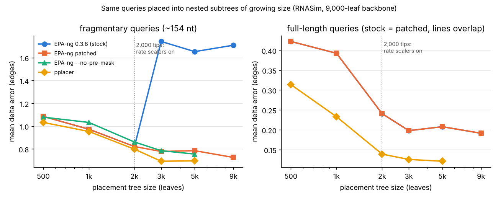

# EPA-ng gets worse on large placement subtrees: diagnosis and fix (CS581 pilot)

## Verdict (short)

**Promising, and the diagnosis is already done.** The BSCAMPP anomaly is not a tree-size effect and not
a heuristic. It is a software bug in EPA-ng (v0.3.8, still on current master). EPA-ng turns on per-rate
likelihood scalers automatically when the reference tree has **more than 2,000 tips**. Its premasking
code then shifts every scaler buffer by `offset` sites instead of `offset × rate_cats`. The scaling
factors are therefore misaligned to the wrong sites and rate categories in the thorough-placement phase.
Any query whose first non-gap site is not at the start of the alignment gets wrong likelihoods,
inflated by thousands of log units. This covers fragments and amplicon reads, not full-length sequences.
The result is a near-doubled delta error and falsely confident placements (LWR = 1.0). A 5-line patch
fixes it (`code/epa-ng-fix.patch`). With the patch, error keeps decreasing as subtrees grow past 2,000
leaves, and the patched EPA-ng is also faster on large trees (SIMD kernels are kept).
See [Verdict and 4-week plan](#verdict-and-4-week-plan).

## 1. Question and source open problem

Wedell, Shen & Warnow, *BSCAMPP: batch-scaled phylogenetic placement on large trees*, IEEE/ACM TCBB 2025
(doi:10.1109/TCBBIO.2025.3562281; manuscript https://par.nsf.gov/servlets/purl/10584552):

> "When the subtree size exceeds 2,000 leaves, BSCAMPP(e) had over twice the delta error than it did for
> 1,000- and 2,000-leaf subtrees; therefore, we set the default subtree size to 2,000."

> "our preliminary study showed that EPA-ng had a jump in placement delta error as we increased the
> subtree size for the RNASim dataset. Thus, our study potentially suggests that EPA-ng may have some
> numeric issues when placing into very large trees that result in increased placement error [...].
> Further research is needed to understand whether this explanation is correct."

The same paper reports that EPA-ng on the full RNASim 180K tree was "much more" error-prone than every
SCAMPP/BSCAMPP pipeline (Exp. 5). Its Experiment 1 used true query alignments, with fragmentary
queries (~10% of length, ~155 nt) on a masked RNASim alignment. Question: why does EPA-ng's error jump
above 2,000 leaves, and can it be fixed, so that BSCAMPP can use larger subtrees?

## 2. Prior art and novelty check (≈40 min)

Searched for: BSCAMPP follow-ups on subtree size (2025–2026); EPA-ng accuracy vs reference-tree size
and heuristics; PEWO (Linard et al. 2020) placement benchmarks; the EPA-ng GitHub issue tracker
(pierrebarbera/epa-ng, 54 issues, searched for "scaler", "likelihood", "-INF"); EPA-ng release notes;
the RAxML Google group; Wedell's UIUC thesis records.

* The BSCAMPP paper itself leaves the cause open (quotes above). The SCAMPP paper (Wedell et al. 2022)
  attributes pplacer's large-tree failures to numerics (−inf likelihoods). Nothing found tests EPA-ng
  accuracy as a function of tree size.
* EPA-ng docs/paper (Barbera et al., Syst. Biol. 2019) describe the heuristics (`--dyn-heur` default,
  `--baseball-heur`, `--no-heur`) and say they lose only "insignificant amounts of accuracy". PEWO
  benchmarks heuristics, not tree size.
* EPA-ng issues #34, #50 (−INF errors) are model/input mistakes. No issue or release note mentions
  rate scalers, premasking or `shift_partition_focus`. Release notes for 0.3.4–0.3.8 list other bugs only.
* The faulty line is unchanged on current master (commit b24ea4a, checked 2026-10-10).

**Novelty:** as far as I can find, the bug and its link to the BSCAMPP 2,000-leaf anomaly are new.

## 3. Methods

**Data.** RNASim 10K replicates R0 (and R1 for replication) from the MAGUS paper data
(/opt/data/Datasets/RNASim/10000, subsets of RNASim 1M; true alignment and true tree). The BSCAMPP
RNASim placement data (IDB-1048258) is a 4 GB archive, so the 10K sets were used. Per replicate:
1,000 random queries, 9,000-leaf backbone. Alignment sites with >95% gaps among backbone sequences
were masked, as in BSCAMPP (8,700 → 1,623 sites). Fragments follow BSCAMPP: random start, length ~
N(10% of ungapped length, sd 10) → mean 154 nt (120–187). Full-length queries are also tested. All
placement uses the **true** query alignment.

**Backbone.** FastTree-2 (GTR+Γ) on the true backbone alignment; RAxML-NG 2.0.3 `--evaluate GTR+G`
re-estimates branch lengths and the model (used for EPA-ng and BSCAMPP(e), as in the paper). FastTree
GTR+Γ20 parameters on the RAxML-NG topology are used for pplacer (via taxtastic, as BSCAMPP(p) does).
FastTree ME branch lengths are used for APPLES-2. Backbone FN rate vs the true tree: 976/8,997 (10.8%).

**Delta error** (as in SCAMPP/BSCAMPP): for query q placed on backbone edge e,
FN(T + q@e vs T\*|B∪q) − FN(T vs T\*|B). It is computed exactly for every query with xor-hashed
bipartitions (`code/deltalib.py`). Validated: with T = T\*|B, the true attachment edge scores 0 for
every query tested, and other edges score their edge distance. Placements on subtrees are mapped back
onto the 9,000-leaf backbone: a subtree edge is a path in T, and the position along it follows the
distal length. The best-LWR placement is scored.

**Experiment A (nested subtrees, the mechanism).** 17 centre leaves. For each centre, nested subtrees of
500/1k/2k/3k/5k leaves are grown with BSCAMPP's own routine (`subtree_nodes_with_edge_length`), plus the
full 9,000-leaf tree. The queries for a centre are those whose closest backbone leaf (Hamming
distance, fragment sites only) lies among the 200 leaves nearest the centre. That gives 303 queries,
each placed into every size, so all comparisons are paired. Methods: stock EPA-ng 0.3.8 (bioconda;
default dynamic heuristic, `auto` rate scalers), `--rate-scalers on`, `--no-pre-mask`, `--no-heur`,
pplacer 1.1.alpha19, a diagnostic build that forces non-SIMD kernels, and patched EPA-ng. APPLES-2
on the full backbone is a distance-based control.

**Experiment B (end-to-end BSCAMPP).** `run_bscampp.py` (bscampp 1.0.8 from pip, 5 votes) on all 1,000
queries, subtree size b ∈ {1000, 2000, 5000, 9000}, stock vs patched EPA-ng (swapped in through a
wrapper). Baseline = stock BSCAMPP(e), b = 2000. Runtimes are wall clock on the otherwise idle 4-core
machine (`--threads 4`, `--cpus-per-job 2`; b ≥ 5000 uses `--cpus-per-job 4`, because two
5,000-leaf EPA-ng jobs need >15 GB); peak RSS comes from GNU time.

**Significance.** Paired Wilcoxon signed-rank on per-query delta error, with W/T/L counts.

## 4. Diagnosis

1. **Reproduced the jump** (Exp. A, fragments, stock EPA-ng): mean delta 1.09 / 0.97 / 0.82 at
   500 / 1k / 2k leaves, then **1.74 / 1.65** at 3k / 5k on the same 303 queries. That is more than double, as in BSCAMPP.
2. **The 2,000 threshold is hard-coded in EPA-ng**: `Tree_Numbers::large_tree() { return tip_nodes > 2000; }`.
   With the default `--rate-scalers auto`, `make_partition` then sets
   `attributes = PLL_ATTRIB_RATE_SCALERS;`. That turns on per-rate scalers and, because it is `=`
   rather than `|=`, also drops the SIMD architecture bits.
3. **Forcing rate scalers on small trees reproduces the jump**: `--rate-scalers on` at 500/1k/2k leaves
   raises mean delta to 2.06 / 1.98 / 1.73 (W/T/L 26/121/156 at 500, p≈1e-17). Above 2,000 its output
   is identical to the default.
4. **SIMD loss is not the cause**: a build that forces non-SIMD kernels without rate scalers gives
   identical placements (303/303 ties at every size). A build that keeps SIMD with rate scalers is
   exactly as bad as stock.
5. **The likelihoods are wrong, not just imprecise**. Same query, same 500-leaf tree: best edge logL
   −37,845.3 (scalers off) vs −28,162.9 (scalers on). With scalers on, the LWR collapses to 1.0 on a
   different edge.
6. **Root cause** (`src/core/pll/pll_util.cpp`, `shift_partition_focus`): with premasking (default),
   the thorough phase evaluates only the query's non-gap site range. It shifts the CLV pointers by
   `offset × rate_cats × states` (correct) but every scaler buffer by `offset` (correct only for
   per-site scalers). Per-rate scaler buffers hold `rate_cats` entries per site, so the shift must be
   `offset × rate_cats`. Otherwise site *n* reads the scale counts of another site/rate. The bug
   needs both per-rate scalers (auto: >2,000 tips) and a nonzero offset (a query that does not start
   at column 0). That explains why it hit BSCAMPP's fragmentary design experiment, and predicts that
   full-length queries are unaffected. They are (Exp. A, full-length: stock = patched, 303/303
   ties at every size). `--no-pre-mask` avoids the shifted call and removes the jump (table below),
   at ~2× runtime.
7. **Fix** (`code/epa-ng-fix.patch`, 2 hunks): shift scalers by `offset × (RATE_SCALERS ? rate_cats : 1)`,
   and `attributes |= PLL_ATTRIB_RATE_SCALERS` (keeps SIMD; speed only). With rate scalers on, the
   patched binary reproduces the scaler-free placements exactly (same edges, logL equal to 4 decimals).

## 5. Results

*Figure: the same 303 queries placed into nested subtrees around 17 centres (R0). Full-tree (9k)
points are direct EPA-ng runs on the whole backbone.*

### 5.1 Nested subtrees (Exp. A, R0, 303 queries, every cell paired)

Mean delta error (edges), fragmentary queries (~154 nt):

| method | 500 | 1k | 2k | 3k | 5k | 9k (full tree) |
|---|---|---|---|---|---|---|
| EPA-ng 0.3.8 stock (default) | 1.086 | 0.974 | 0.822 | **1.743** | **1.653** | **1.710** |
| EPA-ng patched (both hunks) | 1.086 | 0.974 | 0.822 | 0.779 | 0.785 | 0.729 |
| stock `--no-pre-mask` (workaround) | 1.079 | 1.033 | 0.861 | 0.785 | 0.756 | - |
| stock `--no-heur` | 1.086 | 0.974 | 0.822 | **15.00** | **16.99** | - |
| stock `--rate-scalers on` | 2.02 | 1.93 | 1.80 | 1.74 | 1.63 | - |
| pplacer (FastTree params) | 1.033 | 0.954 | 0.799 | 0.693 | 0.696 | - |

CONTROLS_PLACEHOLDER

Paired tests vs stock at the same size (fragments, n=303): patched at 3k: −0.964, W/T/L 142/133/28,
p=4e−17. Patched at 5k: −0.868, 138/142/23, p=1e−16. At ≤2k, stock and patched are identical
(303/303 ties), as are stock and the non-SIMD build. Patched minus stock at 3k/5k/9k equals the
size of the jump. **With the fix, error keeps falling as the tree grows** (0.82 at 2k → 0.78 at
3k → 0.73 at 9k), the trend pplacer shows (0.80 → 0.69).

Full-length queries: stock = patched at every size (303/303 ties; 0.42 / 0.39 / 0.24 / 0.20 / 0.21 /
0.19), so there is no jump. pplacer is more accurate than EPA-ng on full-length queries in this setting
(0.15 vs 0.24 at 2k). APPLES-2 on the full backbone: 7.33 (fragments) and 2.16 (full length), far
worse, consistent with the BSCAMPP paper.

**`--no-heur` does not remove the jump; it makes it catastrophic** (15–17 edges at 3k/5k). Without
preplacement, every edge goes through the focused thorough phase with misaligned scalers, so a
wrongly inflated likelihood on a distant edge can win. The default dynamic heuristic shortlists
candidates with the *correct* (unfocused) lookup likelihoods, which limits the damage to about 1
edge. NOHEUR_FIX_PLACEHOLDER

**Overconfidence.** Share of fragments whose best placement has LWR ≥ 0.9999: 0.18 at every size
for patched EPA-ng, but 0.62 / 0.59 / 0.58 for stock at 3k / 5k / 9k (0.91–0.94 with `--no-heur`).
The bug makes EPA-ng confidently wrong, so downstream users would not see the error as uncertainty.

**Which queries are hurt.** Harm (stock − patched delta at 5k) is positive across all fragment start
positions: 0.49 for starts in the first 200 columns, 0.77–1.26 elsewhere (Spearman ρ = 0.14 with
start column, p = 0.01).

### 5.2 End-to-end BSCAMPP(e) (Exp. B, 1,000 queries per replicate, 4 replicates)

Fragments; mean delta; baseline = stock BSCAMPP, b = 2000 (the published default):

| replicate | stock b2000 (baseline) | stock b5000 | patched b5000 | patched b9000 |
|---|---|---|---|---|
| R0 | 0.798 | 1.607 | 0.715 | 0.661 |
| R1 | 0.846 | 1.682 | 0.721 | (out of memory) |
| R2 | 0.854 | 1.651 | 0.764 | 0.737 |
| R3 | 0.941 | 1.626 | 0.829 | 0.765 |
| **pooled** | **0.860** | **1.641** (W/T/L vs base 379/1839/1782, p≈1e−171) | **0.757** (−0.102; 134/3750/116; p=0.03) | **0.721** vs 0.864 (−0.143; 125/2769/106; p=0.03) |

Stock b=9000 (R0): 1.539. Stock b=1000 (R0): 0.916.
**The published anomaly reproduces end-to-end on every replicate** (b=5000 roughly doubles the error).
**The patch removes it**: patched b≤2000 is identical to stock (4000/4000 ties). Patched b=5000/9000
is 12–17% more accurate than the published default. The gain is concentrated in a minority of
queries: ~94% tie, and per replicate only R1 is individually significant. Treat it as a real but
modest improvement.

Full-length queries (pooled, n=4000): baseline 0.215, patched b5000 0.203 (−0.013; 55/3909/36; p=0.02).
Stock b5000 0.205 (p=0.1); the bug barely touches full-length queries.

Runtime and memory (wall clock, idle 4-core machine; fragments; typical over replicates):

| config | wall (s) | peak RSS (GB) |
|---|---|---|
| stock b1000 | 32 | 1.3 |
| stock b2000 (baseline) | 35 | 2.7 |
| stock b5000 (cpus-per-job 4) | 73–87 | 7.5 |
| patched b5000 (cpus-per-job 4) | 59–71 | 7.5 |
| patched b9000 (one subtree) | 51–60 | 12.9–13.8 |

Patched b=5000 costs ~2× the baseline's time for the accuracy gain. Part of that is the forced
`--cpus-per-job 4` (one job at a time, for memory). b=9000 is near this machine's 15 GB limit (one
of four runs was killed). Bigger b means fewer but larger EPA-ng jobs: EPA-ng's memory grows with
the tree, and BSCAMPP's speed comes from many small jobs.

TIMING_PLACEHOLDER

## Verdict and 4-week plan

VERDICT_PLACEHOLDER
