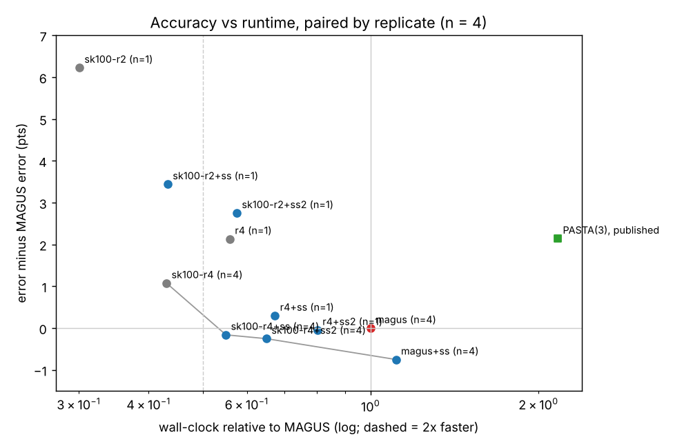

# Fast MAGUS: can a cheaper guide tree + fewer backbones + self-soft beat MAGUS at ≥ 2× speed?

Pilot, 2026-10-10, one 4-core / 15 GB cloud machine, ~4.5 h wall-clock.
Code: `code/fm_bench.py` (runner), `code/fm_worker.sh` (restartable job loop), `code/analyze.py`
(tables + plot). Results: `results/local.jsonl` (raw), `results/summary.md`, `results/pareto.png`.

## Question

Can MAGUS(Fast) with the paper's flags be made **≥ 2× faster at equal or better accuracy**?
MAFFT-L-INS-i stays the subset aligner. Only two things change: how the guide tree is built,
and how the merge evidence is produced. Knobs tried:

- cheaper guide trees: MAGUS `-t parttree`, `-t clustal`, or `--decompskeletonsize 100`;
- fewer MAFFT backbones (`-r 4`, `-r 2`; size kept at 200);
- recovering accuracy with this repo's **self-soft** step: MAGUS's own output restricted to 8
  sequences per subset gives 10 pseudo-backbones, which are HMM-extended; each subset is split
  into 3 groups and all groups are merged at once (soft constraints). Self-soft is run
  once (`+ss`) or twice (`+ss2`).

## Protocol

- Every variant runs **end to end from unaligned sequences**, one at a time on an otherwise
  idle machine (`-np 4`).
- Wall-clock and child CPU are measured. A `+ss` row is the measured base run plus the
  measured extra steps (split, evidence, merge).
- Error = (SPFN+SPFP)/2 from FastSP (`gcmx.score`).
- `magus` is pure MAGUS with the paper's flags (`--gcmx-fastgraph false`, MCL single-threaded).
- Every fast variant also uses two output-identical speedups from this repo:
  - vectorized graph build;
  - `--gcmx-mclthreads 4`.
  On these 1000-sequence data, cluster+trace is only 1–3% of MAGUS's time, so they contribute
  little.
- Replicate names are `<dataset>_R<i>`: a dataset from the MAGUS paper's data plus the
  replicate number. 1000M2 and 1000L1 are ROSE simulated DNA conditions, BBA0101 is a BAliBASE
  protein family, and R0 is the first replicate.
- Comparisons are paired by replicate against our own MAGUS run. Because MAGUS's own backbone
  draw is noisy (see the caveats), every variant is also compared with the authors'
  **published** MAGUS(Fast) alignment of the same replicate.

**Scope shortfall (be aware):** I ran on a single machine and did not spawn extra cloud
workers, because that wasn't requested. The plan of ≥10 replicates across all conditions did
not fit: one MAGUS run alone takes 16–26 min here. The final set is the pilot on 1000M2_R0
(all variants) plus 1000L1_R0, BBA0101_R0 and 1000S2_R0 for the leading variant. **No result
below is statistically significant (n ≤ 4).** `code/fm_worker.sh` with `code/jobs/*.txt` can
run the full ≥10-replicate confirmation on parallel workers unchanged.

## Where MAGUS spends its time (this machine, paper flags)

| replicate | wall s | guide tree | 25 subset alignments + 10 backbones (one shared 4-slot task pool) | cluster + trace |
|---|---|---|---|---|
| 1000M2_R0 | 1323 | 253 s (19%) | 1052 s (79%) | 17 s (1%) |
| 1000L1_R0 | 1552 | 288 s (19%) | 1245 s (80%) | 16 s (1%) |
| BBA0101_R0 (322 seq, protein) | 989 | 175 s (18%) | 776 s (78%) | 37 s (4%) |

- On this machine the guide tree is ~19% of the time, not the 31% seen in the published logs.
  MAGUS runs the subset alignments and the backbones in the same 4-slot pool, and each MAFFT
  job uses `--thread 4`, so that stage is CPU-bound. Its wall time therefore scales with the
  total MAFFT CPU, which the backbones dominate (~380 CPU-s per 200-sequence backbone on 1000M2).
- A self-soft round costs ~120–200 s:
  - HMM evidence: 55–95 s;
  - merge with threaded MCL: 70–105 s on DNA, more on bad subsets.

## Variants and results

Full per-replicate table: `results/summary.md`. Δ = variant error − MAGUS error in points
(negative = better). Speedup = MAGUS wall / variant wall.

### Pilot, 1000M2_R0 (all variants)

| variant | guide tree | backbones | self-soft rounds | error % | wall s | speedup | Δ vs our MAGUS | Δ vs published MAGUS |
|---|---|---|---|---|---|---|---|---|
| magus (paper flags) | FastTree, skeleton 300 | 10 | 0 | 9.74 | 1323 | 1.00× | 0 | +1.49 |
| magus+ss | FastTree, 300 | 10 | 1 | 8.76 | 1470 | 0.90× | −0.98 | +0.50 |
| pt-r4 | MAFFT PartTree | 4 | 0 | **44.75** | 652 | 2.03× | +35.0 | |
| pt-r4+ss | PartTree | 4 | 1 | 39.69 | 1272 | 1.04× | +30.0 | |
| cl-r4 | Clustal Omega mBed | 4 | 0 | **26.59** | 577 | 2.29× | +16.9 | |
| r4 | FastTree, 300 | 4 | 0 | 11.87 | 740 | 1.79× | +2.13 | |
| r4+ss | FastTree, 300 | 4 | 1 | 10.04 | 892 | 1.48× | +0.30 | |
| r4+ss2 | FastTree, 300 | 4 | 2 | 9.69 | 1063 | 1.24× | −0.05 | |
| sk100-r4 | FastTree, skeleton 100 | 4 | 0 | 11.37 | 581 | 2.28× | +1.63 | +3.11 |
| **sk100-r4+ss** | FastTree, 100 | 4 | 1 | **9.02** | 734 | **1.80×** | **−0.72** | +0.77 |
| sk100-r4+ss2 | FastTree, 100 | 4 | 2 | 8.79 | 903 | 1.46× | −0.95 | +0.53 |
| sk100-r2 | FastTree, 100 | 2 | 0 | 15.97 | 398 | 3.33× | +6.23 | |
| sk100-r2+ss | FastTree, 100 | 2 | 1 | 13.18 | 573 | 2.31× | +3.44 | |
| sk100-r2+ss2 | FastTree, 100 | 2 | 2 | 12.49 | 762 | 1.74× | +2.75 | |

Pilot findings:

1. **Alignment-free guide trees fail on divergent ROSE DNA.** PartTree and Clustal mBed (both
   k-mer based) make nearly random subsets. The mean within-subset true p-distance is 0.655
   (PartTree) and 0.624 (Clustal), against 0.695 for random sets. Error rises to 45% and 27%,
   and self-soft cannot repair a bad decomposition (39.7%); its merge on those subsets also
   gets slow (432 s).
2. **A smaller skeleton is close to free.** Skeleton 100 cuts the guide tree from ~250–290 s to
   ~80–105 s, and sk100-r4 is no worse than r4 (11.37 vs 11.87). This is the one guide-tree knob
   that works.
3. **4 backbones is the floor.** With 2 backbones the base error is +6 points, and two self-soft
   rounds still leave it +2.75. With 4 backbones, self-soft brings the error back to MAGUS level.
   Since the MAFFT stage is CPU-bound, 4 backbones (not 3 or 5) is also the natural choice for
   4 cores.

### Leading variant across replicates (sk100-r4 ± self-soft)

| replicate | MAGUS err / wall | magus+ss | sk100-r4 | **sk100-r4+ss** | sk100-r4+ss2 | published MAGUS(Fast) err |
|---|---|---|---|---|---|---|
| 1000M2_R0 | 9.74 / 1323 s | 8.76 / 1470 s | 11.37 / 581 s | **9.02 / 734 s** | 8.79 / 903 s | 8.25 |
| 1000L1_R0 | 7.88 / 1552 s | 7.09 / 1675 s | 8.93 / 732 s | **8.01 / 867 s** | 7.83 / 996 s | 8.11 |
| 1000S2_R0 | 3.89 / 1049 s | 3.08 / 1116 s | 4.71 / 453 s | **3.90 / 523 s** | 3.81 / 589 s | 3.48 |
| BBA0101_R0 | 28.03 / 989 s | 27.60 / 1185 s | 28.83 / 385 s | **27.95 / 593 s** | 28.10 / 737 s | 28.45 |

Paired with our MAGUS run (n = 4; tie band 0.05 points; two-sided Wilcoxon):

| variant | mean Δ (pts) | W/T/L | Wilcoxon p | wall speedup | CPU ratio | mean Δ vs published MAGUS(Fast) |
|---|---|---|---|---|---|---|
| magus+ss (accuracy reference) | −0.75 | 4/0/0 | 0.125 | 0.90× | 0.95× | −0.44 |
| sk100-r4 | +1.07 | 0/0/4 | 0.125 | **2.32×** | 2.39× | +1.38 |
| **sk100-r4+ss** | **−0.16** | 2/1/1 | 0.88 | **1.82×** | **2.12×** | +0.15 |
| sk100-r4+ss2 | −0.25 | 2/1/1 | 0.38 | 1.54× | 1.92× | +0.05 |

(With n = 4, the smallest possible two-sided Wilcoxon p is 0.125.)

## Accuracy–runtime plot



Points with n = 1 come from the 1000M2_R0 pilot only; PartTree and Clustal are off the
scale (+30 to +35 and +17 points). x = wall-clock relative to our MAGUS run (log scale; dashed line = 2× faster); y = Δerror.
Green square: PASTA(3) from the authors' published logs and alignments of the same
replicates. It is 2.17× *slower* than MAGUS(Fast) and +2.14 points worse there, so it sits far
up and to the right.

## Verdict: **unclear, leaning "not" for the stated goal**

**The best balanced variant is sk100-r4+ss:**
- FastTree guide tree on a 100-sequence skeleton;
- 4 MAFFT-L-INS-i backbones;
- one self-soft round.

It is **1.82× faster in wall-clock (2.12× in CPU) at MAGUS-level accuracy**: −0.16 points vs
our MAGUS runs and +0.15 vs the published MAGUS alignments, 2 wins / 1 tie / 1 loss. So it
**ties MAGUS at ~1.8×. It is neither ≥ 2× faster nor clearly more accurate**, and it is clearly
worse than MAGUS+self-soft (by ~0.6 points), which is the accuracy bar the self-soft work
already set.

Pushing the variant to ≥ 2× costs accuracy:
- dropping self-soft gives 2.3× at +1.1 points;
- 2 backbones gives 3.3× at +6 points, and self-soft only partly repairs that.

What the pilot established:
- Alignment-free guide trees (PartTree, Clustal mBed) are unusable on divergent DNA
  (+17 to +35 points). The guide-tree savings must come from a smaller alignment-based skeleton.
- Skeleton 100 saves ~65% of the guide-tree time at no measurable cost.
- The 10 backbones are the real cost (~80% of the wall together with the subset alignments).
  4 backbones are needed; with fewer, self-soft cannot recover.
- Self-soft repairs most of what 6 fewer backbones lose (−1.2 points of the +1.1 gap on
  average). Its wall time (~120–200 s per round) is now what blocks 2×.
- Self-soft is under-parallelized: wall speedup 1.82× vs CPU ratio 2.12×. Its HMM evidence
  step and Python parts do not fill 4 cores.

## What a 4-week project would look like

1. **Week 1: confirmation.**
   - Run `code/fm_worker.sh` on ≥ 10 replicates per condition: ROSE L/M/S, RNASim 1000, and
     the 8 BAliBASE sets.
   - Variants: MAGUS, magus+ss, sk100-r4+ss, sk100-r4+ss2. The job lists are ready.
   - Needs ~4–6 parallel workers, ~3 h each.
   - Use the published MAGUS alignments as a second baseline: backbone-draw noise is ~1.5
     points on 1000M2_R0 (9.74 here vs 8.18 in an earlier run on the same machine type vs 8.25
     published).
2. **Week 2: engineer the remaining ~10–20% of wall-clock** (all output-preserving or cheap):
   - run the self-soft HMM extension in parallel with the merge's graph build;
   - use 5 pseudo-backbones instead of 10, or extend only to the sequences not already in a
     pseudo-backbone;
   - start the self-soft evidence as soon as the base merge is done;
   - test whether MAFFT `--thread 1` per pool task, instead of MAGUS's `--thread 4` ×
     4 slots (oversubscribed), lowers the backbone-stage wall at identical output. This must be
     verified: multithreaded MAFFT is not guaranteed to be bit-identical.
   - Target: sk100-r4+ss at ≥ 2.0× wall.
3. **Week 3: accuracy side.** Use 3 backbones plus a second self-soft round, or put
   evidence-weighted pseudo-backbones in place of one MAFFT backbone, to reach "better than
   MAGUS" rather than "tie". Measure scaling on RNASim 10K / 16S.T, where the guide tree and
   the merge take larger shares.
4. **Week 4:** final paired statistics, the Pareto plot with PASTA/MAGUS published points, and
   the write-up.

## Risks

- **The 2× target may simply be out of reach at equal accuracy** with MAFFT-L-INS-i fixed. Even
  with a perfect guide tree and zero-cost self-soft, 4 backbones + 25 subset alignments take
  ~33–41% of MAGUS's wall here, but a self-soft round costs another 10–15%.
- **Noise.** MAGUS's own backbone draw moves error by 0.6–1.5 points per replicate, so a
  "−0.2 point" claim needs many replicates; n = 4 here is far from that.
- **Machine dependence.** The stage split differs from the published logs (guide tree 19% here
  vs ~31% there), so speedup ratios may not transfer to other hardware or core counts.
- **Novelty is modest.** "Fewer backbones + an iterative refinement" is engineering, not a new
  algorithm. The interesting part is the self-soft evidence; it may be better framed as an
  accuracy method that also enables cheaper evidence.

## Reproduce

```
bash cs581/code/setup.sh
bash cs581/fastmagus/code/fm_worker.sh local       # jobs: code/jobs/local.txt (re-read from the branch)
python cs581/fastmagus/code/analyze.py              # results/summary.md, results/pareto.png
```

Housekeeping note: on 1000L1_R0 the job was stopped after its sk100-r4 rows were complete, to
skip the 2-backbone variant; its row in `results/local.jsonl` was written from the run's state
file. All values are measured; none are estimated.
