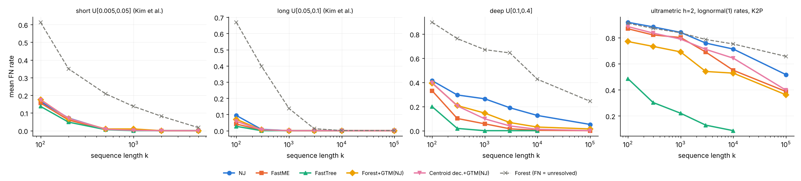
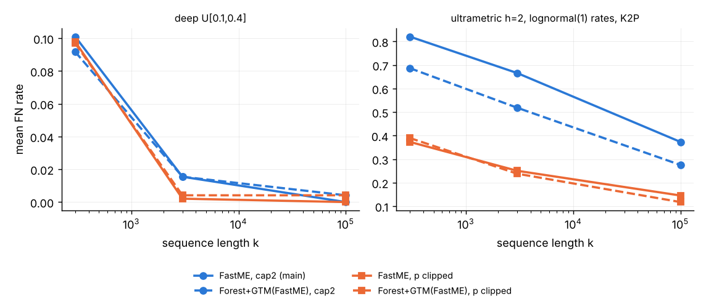

# Forest+DTM pilot: do DMR forest components + GTM beat NJ / FastME at short sequence lengths?

CS581 (Fall 2026) project pilot, candidate idea B from `cs581/literature/wide_scan.md` §2.1.
Everything here is reproducible from `cs581/forest/code/` (see "Reproducing" at the end).

## 1. The question and where it comes from

* Divide-and-conquer deck (`581-Divide-and-Conquer-trees-2023`), summary slide: *"The Guide Tree
  Merger (GTM) is the current leading DTM technique, based on empirical performance … However, GTM
  does NOT allow blending … Open problem: Develop a better DTM approach."*
* Lectures 1–2 (statistical consistency, sequence-length requirements, absolute fast converging
  methods): NJ can need exponentially long sequences; AFC methods (short quartets, DCM-NJ) only
  trust short distances.
* Kim, Lokhov, Vuffray, Romero-Severson & Goldberg, *BMC Bioinformatics* 27:186 (2026),
  doi:10.1186/s12859-026-06488-y, implemented the Daskalakis–Mossel–Roch forest algorithm
  (*SIAM J. Discrete Math.* 2011, doi:10.1137/09075576X) in `lanl/distphylo`. Forest returns only the
  reliably reconstructable part of the tree as leaf-disjoint components; it beat NJ only in limited
  cases. Their Discussion proposes, as future work, feeding forest components to a DTM.

**Pilot question.** If we take the forest components as constraint trees and merge them with GTM
under an NJ or FastME guide tree (a modern DCM-NJ), do we get a *full* tree that is more accurate
than NJ / FastME at short sequence lengths, in particular in hard (long-branch, deep) regimes?

## 2. Prior art (≈20 min search; details and DOIs in `lit/prior_art.md`)

* **Not done.** Forest+DTM appears only as a suggestion in Kim et al. 2026 (0 citing works found on
  Semantic Scholar / OpenAlex). None of ~50 works citing DMR 2011 merges forest components with a
  DTM or supertree method.
* Closest ancestors: **DCM-NJ / DCM1** (Huson, Nettles & Warnow, *JCB* 1999,
  doi:10.1089/106652799318337): threshold graph → overlapping small-diameter subsets → NJ per
  subset → strict-consensus merge; **DCM2** (Huson, Vawter & Warnow, ISMB 1999; no DOI found);
  **DCM-NJ+MP** (Nakhleh et al., *Bioinformatics* 2001, doi:10.1093/bioinformatics/17.suppl_1.S190);
  **Short Quartet Method** (Erdős, Steel, Székely & Warnow 1999,
  doi:10.1002/(SICI)1098-2418(199903)14:2<153::AID-RSA3>3.0.CO;2-R and 10.1016/S0304-3975(99)00028-6).
  These use *overlapping* subsets and consensus/dyadic-closure merges, not a disjoint forest + DTM.
* Other "reliable partial tree" methods, none of which merges components: Daskalakis et al. RECOMB
  2006 (doi:10.1007/11732990_24), Mossel TCBB 2007 (doi:10.1109/TCBB.2007.1010), Gronau, Moran &
  Snir RSA 2012 (doi:10.1002/rsa.20372), Mihaescu, Hill & Rao Algorithmica 2013
  (doi:10.1007/s00453-012-9644-4), Brown & Truszkowski AMB 2012 (doi:10.1186/1748-7188-7-32).
* DTMs: NJMerge (doi:10.1186/s13015-019-0151-x), TreeMerge (doi:10.1093/bioinformatics/btz344),
  Constrained-INC (doi:10.1186/s13015-019-0136-9), GTM (Smirnov & Warnow, *BMC Genomics* 2020,
  doi:10.1186/s12864-020-6605-1), Park, Zaharias & Warnow, *Algorithms* 2021 (doi:10.3390/a14050148).

So novelty is not the risk; usefulness is.

## 3. Reproduction / validation of the Forest implementation

`lanl/distphylo` (commit cloned 2026-10-09) is a research script: it hard-codes cluster paths,
shells out to R for scoring, and loops in pure Python with networkx graph copies (8–15 s per
(m, M, τ) point at n = 128). I re-implemented the algorithm (`code/forest_fast.py`) with the same
steps (clustering graph d < m → MiniContractor per leaf pair with 2τ phi-gaps → Extender →
tree popping), using integer bitmasks, one sort per pair shared by all τ, and an exact pairwise
compatibility check.

1. **Exact equivalence on small data** (`code/validate_small.py`, `results/validation_small.tsv`):
   distphylo's own `mini_contractor`/`extender`/`get_unique_trees` (imported unmodified) vs mine on 4
   simulated datasets (n = 24–30, short / long / deep / rate-heterogeneous), 102 (m, M, τ) points,
   64 of them with the ball smaller than the component (Extender active) and 66 with several
   components: **split sets identical on 102/102**, including the validity flag.
2. **distphylo's shipped output** (n = 128, k = 500 alignment `aln_128_500_1.fa`,
   `grid_summary_ntips128_1_k500_sorted.tsv`; `results/validation_distphylo_*.tsv`):

   | (m, M, τ) | published (#splits / false / #comp) | distphylo code rerun | ours |
   |---|---|---|---|
   | (0.8, 2.3, 0.10) | 22 / 0 / 1 | 22 / 0 / 1 | 22 / 0 / 1 |
   | (0.4, 1.0, 0.045) | 49 / 0 / 15 | 49 / 0 / 15 | 49 / 0 / 15 |
   | (0.4, 1.0, 0.03) | 77 / 0 / 15 | 77 / 0 / 15 | 77 / 0 / 15 |
   | (0.5, 1.2, 0.035) (their best) | 99 / 0 / 5 | — | 99 / 0 / 5 |
   | (0.6, 2.0, 0.05), (0.8, 2.0, 0.08) | absent (no forest) | invalid | invalid |
   | (0.6, 1.4, 0.05), (0.45, 1.0, 0.03) | 92 / 1 / 2, 92 / 0 / 9 | — | invalid (93 splits, incompatible) |

   The last row is the only divergence: distphylo's randomized tree popping (10 shuffles of
   `Tree.from_split_bitmasks`) silently drops one conflicting split, whereas I reject incompatible
   split sets. Speed: 0.02–0.17 s vs 0.4–15 s per grid point.
3. **Paper claims reproduced** (n = 128, k = 500 alignment): NJ, BIONJ, FastME and FastTree all
   recover all 125 splits (paper: "NJ … yields all 125 correct splits"); the Forest is
   less resolved — their dense, true-tree-informed grid gives at most 99/125 correct splits;
   my true-tree-free grid search (below) gives 95/125, all correct, in 4 s.
4. **Kim et al.'s simulation result**, short-branch regime (birth–death topology, branch lengths
   U[0.005, 0.05], JC, n = 50): see the "Kim et al. style" table in §5.1 — Forest returns no
   incorrect split more often than NJ at short k, but needs much longer sequences to be fully
   resolved, which is the qualitative finding of their Figs. 3–5.

## 4. Method

**Simulation.** Birth–death topologies (λ = 1, μ = 0.5; dendropy), unrooted; sequences with AliSim
(IQ-TREE 3.1.4). Regimes (n = 100 unless stated, 20 replicates per cell, a new tree per replicate):

| regime | branch lengths | model | why |
|---|---|---|---|
| short (n = 50) | U[0.005, 0.05] | JC | Kim et al. "short" |
| long | U[0.05, 0.1] | JC | Kim et al. "long" |
| deep | U[0.1, 0.4] | JC | many saturated pairs (16–37 % at k ≤ 3000) |
| het | ultrametric BD tree, height 2, × lognormal(0, 1) rate per branch | K2P (κ = 4), K2P distances | long branches next to short ones |

k ∈ {100, 300, 1000, 3000, 10 000, 100 000} (short: 100–5000). Large trees: n = 500, deep and het,
k ∈ {300, 3000}, 5 replicates, reduced grid.

**Distances.** JC (or K2P) from the alignment. Undefined (saturated) distances are replaced by
2 × the largest finite distance for the distance methods (cap2); the Forest uses the raw matrix
(saturated = ∞, never below m or M). A follow-up (§5.3) checks this choice.

**Methods.** NJ (FastME `-m N`), BIONJ (`-m I`), FastME (`-m B -n B -s`, balanced ME + NNI + SPR),
FastTree 2.1.11 (`-nt`, `-gtr` for K2P; skipped at k = 100 000 because it takes ~4 min per run),
and:

* **Forest** with hyperparameters chosen without the true tree, following Kim et al.'s Discussion:
  τ = ½ × {2, 5, 10, 15, 20, 30, 40, 50, 60, 70}th percentiles of the NJ tree's internal branch
  lengths; m = b × {1.0001, 0.9, 0.8, 0.7, 0.6, 0.45, 0.3}, where b is the bottleneck edge of the
  minimum spanning tree (b·1.0001 = smallest m giving one component); M ∈ {2m + 3τ_max + 10⁻³,
  1.5 × that} (Theorem 1 needs M > 2m + 3τ, m > 3τ). Among valid forests (all components
  compatible), keep the one with the most splits. Scored as a partial tree: FN = 1 − (correct
  splits)/(n − 3), FP = false/(forest splits).
* **Forest+GTM(guide)**, guide ∈ {NJ, FastME}: each component with ≥ 4 leaves keeps all its forest
  splits; its polytomies are refined with the guide method re-run on the component's sub-matrix
  ("sub", DCM-style; topped up with induced guide splits), or with the full guide tree's induced
  splits ("ind"). (GTM's loader resolves polytomies in constraint trees arbitrarily, so they must be
  binary first.) Singletons, pairs and triples are passed as they are. GTM (`vlasmirnov/GTM`,
  default `convex` mode) then merges them under the guide tree.
* **Controls** that separate the contribution of the Forest:
  *Forest comps only + GTM* = the same components, forest splits dropped, refined by subset NJ;
  *Centroid dec. + GTM* = the standard DTM pipeline with no Forest: centroid-edge decomposition of
  the guide tree into subsets of ≤ 25 leaves, subset trees by the same method, GTM.

**Statistics.** Per cell, paired by replicate: mean difference in FN rate, W/T/L with tie band
|Δ| < 0.5/(n − 3) (less than one split), two-sided Wilcoxon signed-rank p (zero differences
dropped; p = 1 when all differences are zero). No multiple-testing correction; with 20 replicates
p < 0.01 is the bar I treat as a real difference.

## 5. Results

Full tables (every method, every cell, all paired tests, Kim-style success rates): `results/summary.md`.
Raw per-replicate records: `results/main.jsonl` (480 replicates, 0 errors), `results/followup.jsonl` (60),
`results/large.jsonl` (n = 500), `results/main_coarsegrid.jsonl` (same 480 datasets, coarser Forest grid).



### 5.1 Mean FN rate (main run, 20 replicates per cell; n = 100, short regime n = 50)

| regime | k | NJ | FastME | FastTree | Forest (FN / FP) | F+GTM(NJ) | F+GTM(FastME) | comps-only+GTM(NJ) | centroid+GTM(NJ) |
|---|---|---|---|---|---|---|---|---|---|
| short | 100 | 0.153 | 0.141 | 0.129 | 0.570 / 0.05 | 0.165 | 0.153 | 0.155 | 0.159 |
| short | 200 | 0.077 | 0.061 | 0.051 | 0.372 / 0.01 | 0.076 | 0.066 | 0.073 | 0.070 |
| short | 1000 | 0.006 | 0.004 | 0.000 | 0.141 / 0.01 | 0.013 | 0.011 | 0.006 | 0.003 |
| long | 100 | 0.099 | 0.038 | 0.021 | 0.641 / 0.01 | 0.068 | 0.042 | 0.066 | 0.053 |
| long | 300 | 0.007 | 0.002 | 0.000 | 0.366 / 0.00 | 0.004 | 0.003 | 0.003 | 0.004 |
| long | ≥ 1000 | ≤ 0.001 | 0 | 0 | ≤ 0.13 | ≤ 0.001 | ≤ 0.001 | 0 | 0 |
| deep | 100 | 0.430 | 0.318 | 0.193 | 0.908 / 0.01 | 0.409 | 0.312 | 0.410 | 0.403 |
| deep | 300 | 0.297 | 0.119 | 0.023 | 0.786 / 0.01 | 0.215 | 0.112 | 0.216 | 0.211 |
| deep | 1000 | 0.241 | 0.043 | 0.001 | 0.665 / 0.01 | 0.135 | 0.041 | 0.138 | 0.098 |
| deep | 3000 | 0.204 | 0.014 | 0.000 | 0.608 / 0.01 | 0.084 | 0.014 | 0.088 | 0.053 |
| deep | 10 000 | 0.110 | 0.003 | 0.000 | 0.426 / 0.00 | 0.028 | 0.003 | 0.044 | 0.013 |
| deep | 100 000 | 0.046 | 0.000 | — | 0.237 / 0.01 | 0.015 | 0.003 | 0.022 | 0.002 |
| het | 100 | 0.913 | 0.880 | 0.484 | 0.910 / 0.21 | 0.775 | 0.761 | 0.829 | 0.889 |
| het | 300 | 0.891 | 0.849 | 0.319 | 0.893 / 0.09 | 0.755 | 0.726 | 0.798 | 0.862 |
| het | 1000 | 0.847 | 0.777 | 0.216 | 0.849 / 0.03 | 0.689 | 0.642 | 0.716 | 0.795 |
| het | 3000 | 0.764 | 0.666 | 0.135 | 0.786 / 0.01 | 0.562 | 0.523 | 0.569 | 0.698 |
| het | 10 000 | 0.693 | 0.537 | 0.097 | 0.740 / 0.00 | 0.504 | 0.405 | 0.507 | 0.603 |
| het | 100 000 | 0.571 | 0.425 | — | 0.649 / 0.00 | 0.408 | 0.319 | 0.411 | 0.454 |

(F+GTM = Forest+GTM with subset re-estimation; the "induced" refinement variant is worse in every
hard cell and is listed only in `summary.md`. BIONJ sits between NJ and FastME throughout.)

**Kim et al.-style success rates, short regime (n = 50, 20 replicates):**

| k | P(NJ has no false split) | P(Forest has no false split) | P(Forest fully resolved & correct) | Forest #splits (of 47) |
|---|---|---|---|---|
| 100 | 0.00 | 0.40 | 0.00 | 21.4 |
| 200 | 0.00 | 0.65 | 0.00 | 29.9 |
| 500 | 0.50 | 0.95 | 0.00 | 37.2 |
| 1000 | 0.75 | 0.80 | 0.00 | 40.6 |
| 2000 | 1.00 | 1.00 | 0.00 | 43.3 |

This reproduces the paper's qualitative finding (their Figs. 3 and 5a): with short branches,
Forest avoids false splits at much shorter k than NJ, but it needs far longer sequences to be fully resolved.

### 5.2 Paired tests (FN rate, A − B; W/T/L with tie band < 1 split; two-sided Wilcoxon, 20 pairs)

| regime | k | F+GTM(NJ) − NJ | F+GTM(FastME) − FastME | F+GTM(NJ) − comps-only+GTM(NJ) | F+GTM(NJ) − centroid+GTM(NJ) | F+GTM(FastME) − FastTree |
|---|---|---|---|---|---|---|
| short | 100 | +0.012 (1/10/9, p=0.008) | +0.012 (2/11/7, p=0.04) | +0.010 (0/14/6, p=0.03) | +0.006 (5/7/8, p=0.3) | +0.024 (3/4/13, p=0.03) |
| short | 1000 | +0.006 (0/16/4, p=0.06) | +0.006 (0/16/4, p=0.06) | +0.006 (0/16/4, p=0.06) | +0.010 (0/13/7, p=0.01) | +0.011 (0/13/7, p=0.02) |
| long | 100 | −0.031 (18/2/0, p=2e-4) | +0.004 (3/9/8, p=0.09) | +0.002 (0/18/2, p=0.18) | +0.014 (4/2/14, p=0.02) | +0.021 (1/4/15, p=8e-4) |
| long | 300 | −0.003 (6/13/1, p=0.06) | +0.001 (0/18/2, p=0.16) | +0.001 (0/19/1, p=0.32) | 0.000 (3/14/3, p=1) | +0.003 (0/16/4, p=0.06) |
| deep | 300 | −0.081 (20/0/0, p=9e-5) | −0.007 (11/6/3, p=0.03) | −0.001 (3/15/2, p=0.49) | +0.005 (8/3/9, p=0.54) | +0.089 (0/0/20, p=9e-5) |
| deep | 1000 | −0.106 (20/0/0, p=9e-5) | −0.003 (7/11/2, p=0.17) | −0.003 (3/15/2, p=0.28) | +0.037 (4/0/16, p=0.003) | +0.040 (0/0/20, p=8e-5) |
| deep | 3000 | −0.120 (20/0/0, p=9e-5) | 0.000 (3/14/3, p=0.59) | −0.004 (6/13/1, p=0.15) | +0.030 (3/1/16, p=0.006) | +0.014 (0/3/17, p=2e-4) |
| deep | 10 000 | −0.081 (19/1/0, p=1e-4) | +0.001 (0/19/1, p=0.32) | −0.016 (6/13/1, p=0.06) | +0.015 (3/4/13, p=0.007) | +0.003 (0/15/5, p=0.03) |
| het | 100 | −0.138 (20/0/0, p=9e-5) | −0.119 (20/0/0, p=9e-5) | −0.054 (15/4/1, p=6e-4) | −0.114 (19/0/1, p=1e-4) | +0.277 (0/0/20, p=9e-5) |
| het | 1000 | −0.159 (20/0/0, p=9e-5) | −0.135 (20/0/0, p=9e-5) | −0.027 (7/12/1, p=0.02) | −0.106 (16/0/4, p=5e-4) | +0.426 (0/0/20, p=9e-5) |
| het | 10 000 | −0.189 (20/0/0, p=9e-5) | −0.132 (20/0/0, p=2e-6) | −0.003 (2/17/1, p=0.29) | −0.099 (17/1/2, p=3e-4) | +0.308 (0/0/20, p=9e-5) |
| het | 100 000 | −0.163 (20/0/0, p=9e-5) | −0.107 (20/0/0, p=9e-5) | −0.003 (1/19/0, p=0.32) | −0.045 (17/0/3, p=0.008) | — |

(All 24 cells are in `results/summary.md`; omitted rows are all-tie or say the same thing.)

**Reading.**

1. **Kim et al.'s regimes (short, long): no headroom.** Everything is near zero by k = 300–1000. At
   k = 100 Forest+GTM is slightly *worse* than NJ in the short regime (+0.012, p = 0.008): the
   Forest's few false splits are hard constraints that GTM must keep. The one win, F+GTM(NJ) vs NJ
   in the long regime at k = 100 (−0.031), is smaller than just using FastME (−0.061), and
   F+GTM(FastME) does not beat FastME.
2. **Deep regime: Forest+GTM(NJ) beats NJ by 8–12 FN points (20/0/0)**, but the Forest itself is not
   the reason. Dropping all Forest splits and keeping only its components gives the same
   accuracy (comps-only − F+GTM within 0.016, p ≥ 0.06). A standard centroid decomposition with no
   Forest is *better* for k = 1000–10 000 (by 0.015–0.037, p ≤ 0.007). With a FastME guide there is
   nothing to gain: F+GTM(FastME) − FastME is between −0.007 and +0.003. FastTree is 4–12 points
   better than every distance pipeline at k ≤ 1000.
3. **Rate-heterogeneous K2P regime: large, consistent wins (−0.11 to −0.20 FN vs NJ and FastME,
   20/0/0), but they come from an artifact (§5.3).** This is the only regime where the Forest's own
   splits add anything beyond its components (−0.054 at k = 100, −0.027 at k = 1000), and it is also the
   regime where FastTree is 28–43 points better.

### 5.3 Follow-up: the het-regime win is a saturation-handling artifact

In the main run, saturated distances (undefined JC/K2P correction) were replaced by 2 × the largest
finite distance (cap2) before NJ/FastME. In the het regime, 17–56 % of pairs are saturated. Same
datasets, 10 replicates per cell (`code/followup.py`, `results/followup.jsonl`):



| regime | k | FastME cap2 | FastME cap1.2 | FastME cap5 | FastME p-clipped | F+GTM(FastME) cap2 | F+GTM(FastME) p-clipped | F+GTM − FastME, p-clipped |
|---|---|---|---|---|---|---|---|---|
| deep | 300 | 0.101 | 0.037 | 0.335 | 0.098 | 0.092 | 0.097 | −0.001 (2/7/1, p=0.75) |
| deep | 3000 | 0.015 | 0.001 | 0.053 | 0.002 | 0.015 | 0.004 | +0.002 (0/8/2, p=0.5) |
| deep | 100 000 | 0.000 | 0.000 | 0.001 | 0.000 | 0.004 | 0.004 | +0.004 (0/7/3, p=0.25) |
| het | 300 | 0.821 | 0.765 | 0.869 | 0.373 | 0.687 | 0.390 | +0.017 (4/2/4, p=0.31) |
| het | 3000 | 0.666 | 0.589 | 0.701 | 0.251 | 0.519 | 0.238 | −0.012 (6/2/2, p=0.12) |
| het | 100 000 | 0.373 | 0.330 | 0.448 | 0.145 | 0.275 | 0.118 | −0.028 (9/0/1, p=0.004) |

("p-clipped": the mismatch proportion is clipped at 0.75(1 − 1/√k) for JC, or transversions at
0.5(1 − 1/√k) for K2P, before the correction, so no distance is infinite.)

* How saturated pairs are handled moves FastME by **up to 45 FN points**, far more than any merger
  effect. Under cap2, Forest+GTM "wins" because the Forest's threshold graph (d < m) simply never
  uses the corrupted distances. A better distance correction removes most of that advantage.
* With clipped distances, Forest+GTM(FastME) vs FastME is a tie at k = 300 and 3000. At k = 100 000 it
  wins by 2.8 points (9/0/1, p = 0.004), and FastTree is already better at a tenth of that length (0.097 FN at k = 10 000).
* In the deep regime, a different cap (1.2 instead of 2) helps FastME more (0.101 → 0.037 at
  k = 300) than Forest+GTM does (0.101 → 0.092).
* The FastME-guided controls again match: comps-only + GTM(FastME) = F+GTM(FastME) within 0.025 in every cell.

### 5.4 Sensitivity to the Forest grid

The same 480 datasets were also run with a coarser grid (7 τ × 5 m × 2 M instead of 10 × 7 × 2,
`results/main_coarsegrid.jsonl`). The denser grid yields 1.5–6 more Forest splits per tree and
slightly more false ones (0.03–0.17 more per tree). Merged accuracy changes by ≤ 0.013 FN in every
regime (deep: F+GTM(NJ) 0.161 → 0.148; het: 0.619 → 0.615). The conclusions do not depend on the grid.

### 5.5 Larger trees (n = 500, reduced grid of 18 points, 5 replicates per cell, cap2 distances)

| regime | k | NJ | FastME | FastTree | Forest FN | #comp | F+GTM(NJ) | F+GTM(FastME) | centroid+GTM(NJ) | Forest time (s) |
|---|---|---|---|---|---|---|---|---|---|---|
| deep | 300 | 0.301 | 0.219 | 0.038 | 1.000 | 421 | 0.301 | 0.219 | 0.263 | 130 |
| deep | 3000 | 0.246 | 0.048 | 0.010 | 0.976 | 294 | 0.241 | 0.048 | 0.106 | 161 |
| het | 300 | 0.887 | 0.745 | 0.277 | 0.940 | 130 | 0.672 | 0.617 | 0.810 | 128 |
| het | 3000 | 0.817 | 0.626 | 0.133 | 0.923 | 200 | 0.630 | 0.507 | 0.727 | 321 |

Pooled over k (20 pairs): F+GTM(NJ) − NJ −0.102 (14/6/0, p = 0.001); F+GTM(FastME) − FastME −0.062
(9/11/0, p = 0.008); F+GTM(NJ) − comps-only −0.002 (2/18/0, p = 0.18); F+GTM(NJ) − centroid −0.016
(10/0/10, p = 0.62); F+GTM(NJ) − FastTree +0.35 (0/0/20).

At n = 500 the deep-tree Forest is almost all singletons (the selected forest resolves 0–14 of 497
splits), so Forest+GTM *is* the guide tree. The het-regime gains are the cap2 effect of §5.3
(not re-checked with clipped distances at n = 500), and again the components alone give the same
tree. The code does scale to n = 500 (2–5 min per replicate), but the Forest gets less useful as n grows.

## 6. Runtime

Mean wall-clock seconds per replicate (one core per replicate; 4–8 replicates were sharing 4 cores, so all numbers are inflated by up to ~2×):

| regime, n | k | NJ | FastME | FastTree | Forest grid search (≈ 140 points) | Forest+GTM total | centroid + GTM |
|---|---|---|---|---|---|---|---|
| short, 50 | 100–5000 | 0.01 | 0.02 | 0.2–8 | 0.6–1.8 | 0.9–2.2 | 0.3 |
| long, 100 | 100–100 000 | 0.1 | 0.1 | 0.4–44 | 3–11 | 3–12 | 0.4 |
| deep, 100 | 100–100 000 | 0.1 | 0.1 | 0.6–45 | 5–13 | 6–13 | 0.4 |
| het, 100 | 100–100 000 | 0.05 | 0.1 | 1–66 | 13–66 | 14–67 | 0.3 |
| deep / het, 500 | 300–3000 | 1.8 | 8.6 | 7–11 | 128–321 (reduced grid, 18 points) | 130–325 | 2.2 |

The GTM merge itself takes < 0.5 s. The Forest grid search costs 10–1000 × NJ. My re-implementation is
40–80 × faster per grid point than distphylo (0.17 s vs 8–15 s at n = 128), but each point is still
Θ(n²) leaf pairs × a sort over the ball, i.e. ≈ n³ log n. At n = 500 one replicate takes 3–5 min even
with the reduced grid, and n = 1000 would take ~30–60 min per replicate. (Kim et al. report 13.6 h for
one n = 1000 grid.) FastTree is the slowest baseline only at k ≥ 10 000.

## 7. Verdict: **not promising** (as a "beat the baselines" project)

* In the regimes Kim et al. use, nothing is left to gain: NJ/FastME are almost perfect by k = 300–1000,
  and Forest+GTM is equal or slightly worse (forced false splits).
* Where Forest+GTM(NJ) does beat NJ (deep trees, 8–12 points), the gain comes from the DCM/DTM
  mechanism (small subsets re-estimated, then merged), not from the Forest. Forest components
  without Forest splits do equally well, and an ordinary centroid decomposition + GTM does
  better. With a FastME guide the improvement disappears.
* The only large win (het regime, 10–20 points) comes from the baseline's handling of saturated
  distances. With a sensible distance correction it shrinks to a tie, or 2.8 points at k = 100 000.
* FastTree beats every distance-based pipeline by a wide margin in every hard cell (e.g. deep k = 300:
  0.023 vs 0.112; het k = 1000: 0.22 vs 0.64). The comparison a CS581 reader will ask for is lost before it starts.
* The Forest is expensive (≈ n³ log n per grid point, ~140 grid points) for what it delivers.
  Its components are what matter, and those are just the connected components of the threshold
  graph d < m, i.e. a DCM-style decomposition that costs O(n²).

**What *is* solid and reusable from the pilot:** a fast, validated DMR Forest implementation
(identical to distphylo on 102/102 grid points, 40–80 × faster); a true-tree-free hyperparameter rule
that reaches 95/125 correct splits on distphylo's example (their dense grid, set with knowledge of the
true tree, reaches 99); and a clean negative result with the right controls.

### If someone still wants a 4-week project here

The defensible versions are about *understanding*, not leaderboard wins:

1. **"Is the Forest worth it inside DCM?"** (the cleanest result from this pilot). Compare Forest
   components vs threshold-graph components vs centroid decomposition vs DCM1 padding, all + GTM,
   on deep / heterogeneous model trees (Huson–Nettles–Warnow style), with NJ, FastME and FastTree as
   subset and guide methods. Expected answer: the threshold graph does the work. Week 1 is
   done (this pilot); weeks 2–3 are DCM1 / overlapping subsets with a supertree merger and
   n = 500–1000 using the fast code; week 4 is the write-up.
2. **Forest components as constraints for ML** (Kim et al.'s third hybrid): give
   IQ-TREE / FastTree `-constraints` the Forest's (rarely wrong) splits and test whether short-sequence ML
   gets better or just faster. The risk is that FastTree is already near-perfect where the Forest is
   resolved.
3. **Theory side:** under what branch-length conditions do the Forest's components equal those
   of the plain threshold graph, so that MiniContractor/Extender add nothing for DTM purposes?

### Risks / caveats of this pilot

* One implementation of each step: GTM in its default `convex` mode only, no TreeMerge/NJMerge.
  The subset refinement is my choice, forced by GTM's loader resolving polytomies arbitrarily.
* Distances are model-matched (JC/JC, K2P/K2P). No gamma rate heterogeneity across sites and no
  model misspecification, which is the setting where Kim et al. found Forest most robust (their Fig. 7).
* 20 replicates per cell, n ≤ 100 for the main grid; n = 500 only with a reduced grid and 5 replicates.
* The Forest hyperparameter rule is mine (following the paper's guidance). A rule tuned per regime
  could add splits, but §5.4 suggests the merged tree would barely change.
* FastTree was not run at k = 100 000 (~4 min per run); every method is ≈ 0 there in the easy regimes.

## Reproducing

```
# tools: FastME 2.1.6, IQ-TREE 3.1.4 (AliSim) via micromamba/bioconda; FastTree 2.1.11 (apt);
# python: numpy scipy pandas dendropy networkx biopython matplotlib
git clone https://github.com/lanl/distphylo ~/ext/distphylo; git clone https://github.com/vlasmirnov/GTM ~/ext/GTM
python code/validate_small.py ~/ext/distphylo results/validation_small.tsv
python code/validate_forest.py ~/ext/distphylo results/validation_distphylo_0.tsv 0   # grid point 0..4
python code/run_exp.py results/main.jsonl main 4      # restartable
python code/followup.py results/followup.jsonl 4
python code/run_exp.py results/large.jsonl large 4
python code/analyze.py results                        # -> results/summary.md, *.png
```
Binary paths can be overridden with FASTME, FASTTREE, IQTREE and GTM environment variables (`code/pipeline.py`).
