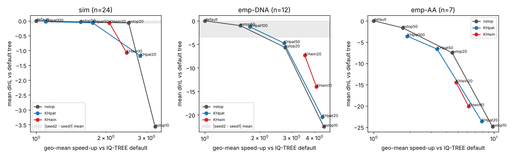

# KH-test early stopping in IQ-TREE 3: overnight pilot

**Verdict: not promising** as a 4-week CS581 project aiming to beat the strongest baseline (details and an
alternative framing at the end).

## Question and source

Togkousidis, Stamatakis & Gascuel, "Accelerating Maximum Likelihood Phylogenetic Inference via Early Stopping to
Evade (Over-)optimization", *Syst Biol* 74(6):1020 (2025), doi:10.1093/sysbio/syaf043. They stop RAxML-NG's
(simplified) SPR search when a Kishino-Hasegawa (KH) test says the last round did not significantly improve
the tree. They report 5x (DNA) / 3.9x (AA) speed-ups for KH-mult vs RAxML-NG 1.2, and write that their criteria
"can also be seamlessly integrated into other phylogenetic inference tools that use numerical convergence
thresholds such as PhyML and FastTree."
IQ-TREE 3 still stops after 100 unsuccessful perturbation iterations (`-nstop 100`) unless `--fast` is given.

**Question.** Does a KH-based stopping rule make IQ-TREE 3 at least 2x faster with no significant loss in
log-likelihood or RF accuracy? Is it better than simply lowering `-nstop`, and is it competitive with
RAxML-NG's released early-stopping mode?

## Bottom line (numbers)

* **Speed is easy; the statistics add nothing.** Plain `-nstop 20` (no test) is already 2.8x faster (geo-mean,
  n=43). Every KH variant lies on the **same speed vs lnL-loss curve** as `-nstop N` (figure below). With the
  speed matched (KHpat50 vs nstop20, 1.01x time ratio), the empirical-DNA mean difference is +0.9 lnL
  (W/T/L 3/6/3). Protein data are similar.
* **Why:** across the 44 default runs, **0 of 172 new-best topologies found after the 20 initial iterations
  are KH-significant** against the previous best. Medians: +2.0 lnL (DNA) and +1.0 lnL (protein) at iterations
  21-100, +0.6 to 0.9 after that. Yet these individually non-significant gains add up. On the largest 16S set,
  stopping at iteration 23 loses 86 lnL, and several early trees are AU-rejected against the final one. A per-step
  KH test in IQ-TREE's perturbation loop has too little power, so it turns into a fixed iteration budget.
* **Go/kill (>= 2x faster, no significant loss) fails on empirical data.** At >= 2x, every rule loses lnL
  significantly in the paired test. Empirical DNA (n=12): KHpat50 2.7x, -4.7 lnL, W/T/L 0/2/10, Wilcoxon p=0.002.
  Protein (n=7): KHpat50 3.4x, -6.7 lnL, 0/2/5. Rules that lose nothing (KHpat100 1.8x, nstop50 1.6x) stay
  within seed-to-seed noise but fall short of 2x. On simulated data everything ties: the best topology is found
  in the initial phase, so any rule gives 2-3x for free.
* **The strongest baseline is far ahead in speed.** RAxML-NG 2.0.3 `--fast` already ships the KH-mult rule. It is
  **24x** faster than IQ-TREE default (geo-mean, n=43), compared with 2-4x for the KH-IQ-TREE variants. Its trees
  are worse on empirical DNA (-25 lnL vs default) but still AU-plausible in 100% of cases. On protein it is 46x
  faster at -13 lnL, which beats KHpat20 (7.9x at -24 lnL).
* **The replay is exact:** real `-nstop 20` runs stop at the same iteration with the same best lnL (+-0.3) on 4/4
  checked datasets.
* **Reproduction of the published number:** RAxML-NG `--fast` vs the classic single-parsimony-start search, run as
  paired sequential runs, gives a speed-up of see `results/raxml_repro.md` (about 4.3x on 16S DNA; paper: 5x for
  DNA vs RAxML-NG 1.2).

*Speed-up (geo-mean) vs mean lnL loss relative to the IQ-TREE default tree. Grey: KH-free `-nstop N`
(100/50/20/10). Blue: KH-patience. Red: KH-window. Grey band: mean |lnL(seed 2) - lnL(seed 1)| of the default
itself.*

## Prior art and novelty check

What I searched (2026-10-10):
* web searches for the paper, for "IQ-TREE early stopping / stopping rule / nstop / KH test" in 2025-26, for
  follow-ups citing the paper, for the IQ-TREE 3 paper, and for RAxML-NG 2.0 release notes;
* a direct read of the IQ-TREE 3.1.4 source (`utils/stoprule.cpp`, `tree/iqtree.cpp`, `utils/tools.cpp`);
* `raxml-ng --help` of the installed 2.0.3.

| item | finding | consequence |
|---|---|---|
| Togkousidis et al. 2025, *Syst Biol*; preprint "Much Ado About Nothing", bioRxiv 2024.07.04.602058 | KH (fast normal approximation, Goldman et al. 2000) between the best tree before and after each SPR round of the simplified search; KH-mult adds a Bonferroni correction. 300 TreeBASE MSAs. KH-mult 5x DNA / 3.9x AA vs RAxML-NG 1.2 (1 parsimony start). AU-plausible: >= 98% DNA, 92-94% AA (vs 100%). Names PhyML/FastTree as other targets. | source of the idea; IQ-TREE is not named |
| RAxML-NG 2.0 (Zenodo, Mar 2026; installed 2.0.3) | `--stop-rule sn-rell / sn-normal / kh / kh-mult`; `--fast` = `--search --tree pars{1} --opt-topology simplified --stop-rule kh-mult` | the KH stop is now the **released baseline** in the main competitor |
| IQ-TREE 3.1.4 source (tag v3.1.4, Sep 2026) | `SC_UNSUCCESS_ITERATION`: stop when `iteration > last_improved + nstop`. Any new-best topology resets the counter, however small its gain. Legacy `SC_WEIBULL` (`-sr`, the IQPNNI rule of Vinh & von Haeseler 2004) predicts when to stop; it does not test significance. `--fast` = 2 starting trees + 2 iterations. | **no statistical early stop in IQ-TREE**: the specific idea is open |
| IQ-TREE 3 paper (Wong et al., MBE 2026, msag117) | mixtures, concordance factors, dating, AliSim; nothing on stopping | open |
| "A Systematic Investigation of Overfitting in ML Phylogenetic Inference" (bioRxiv 2025.10.07.680876, same group) | compares RAxML-NG, IQ-TREE, FastTree and RAxML-NG ES; topology overfitting is rare (KIT thesis record). Full text not retrievable (HTTP 429). | context only |
| GitHub/web search for an IQ-TREE issue/PR on early stopping | none found | open, but obvious |

**Novelty:** "KH early stopping in IQ-TREE" is unpublished and unreleased as far as I can find. It is, however,
an obvious port suggested by the original authors, and the same group already ships it in RAxML-NG 2.0.

## Methods

**Data: 44 alignments, 52-445 taxa (43 analysed; one protein run did not finish in time).**
* **Simulated (24).** RAxML Grove empirical DNA trees with their fitted GTR(+I)+G parameters, 8 each with 50-99,
  100-199 and 200-499 taxa, original site counts (495-4,747). Simulated with AliSim (IQ-TREE 3.1.4), no indels.
  True tree = RG tree with branches <= 1e-5 contracted. (`code/simulate.py`)
* **Empirical DNA (12).** Random 100/150/200/300-taxon subsamples of the curated CRW 16S rRNA reference alignments
  (16S.3, 16S.T, 16S.B.ALL; MAGUS-paper data, Illinois Data Bank). Fragments and all-gap columns removed;
  1,770-4,738 sites.
* **Empirical protein (8; 7 analysed).** Random 100-200-sequence subsamples of the BAliBASE RV100 reference
  alignments (107-4,038 columns). (`code/prep_empirical.py`)
* The paper's own 300 TreeBASE MSAs could not be used: Dryad sits behind a bot wall and treebase.org timed out.

**Runs.** All runs are single-threaded with 4 jobs at a time on a 4-core VM. Fixed models, no ModelFinder:
GTR+F+I+G4 for DNA, LG+G4 for protein. (`code/run_jobs.sh`, `code/scheduler.py`)
* `default` (iqdef1): IQ-TREE 3.1.4 default search. The binary is rebuilt from the v3.1.4 tag with a 12-line patch
  (`code/iqtree_trace.patch`) that writes, per iteration: wall time, score, best score, whether a new best
  *topology* appeared (the event that resets the `-nstop` counter), and that tree. On the test case the output is
  identical to the stock bioconda binary.
* `iqdef2`: the same with seed 2, measuring run-to-run noise. Run on the 18 datasets whose default run took < 700 s.
* `iqfast`: IQ-TREE `--fast`.
* `rxfast`: RAxML-NG 2.0.3 `--fast`.
* `iqnstop20`: real `-nstop 20` runs on 6 datasets, to validate the replay.
* Reproduction: RAxML-NG `--fast` vs `--search --tree pars{1} --opt-topology classic`, run as paired sequential
  runs (`code/rx_repro.sh`).

**Rules, replayed offline on the trace** (`code/replay.py`). The search is seeded, so a run stopped at iteration s
equals the default run truncated at s. Rule time = trace time at s + the default run's post-search time.
* `nstopN` (N = 50/20/10): IQ-TREE's own rule with less patience. This is the non-statistical comparator.
* `KHpatN` (N = 100/50/20): a new-best topology counts as a success only if a one-sided fast KH test (alpha 0.05,
  per-site lnL differences, as in the paper) shows it is significantly better than the last *significant* best.
  Stop N iterations after the last success. KHpat100 is the drop-in version.
* `KHwinK` (K = 20/10): the RAxML-style rule. After the 20 initial iterations, every K iterations, test the current
  best against the best from K iterations earlier; stop at the first non-significant window. `KHwin10mult` adds a
  Bonferroni correction over the number of new-best topologies in the window. It is identical to KHwin10 here,
  because nothing is significant anyway.

**Scoring.** Per dataset, all distinct trees (every new-best topology in the trace plus the comparators) are scored
in a single IQ-TREE run (`-z -n 0 -wsl -zb 1000 -au`): one model fit, branch lengths optimized per tree. Trees are
pruned to IQ-TREE's de-duplicated taxon set. This run also supplies the site lnLs for the KH tests and the AU
p-values. Late comparators (`iqdef2`, `iqnstop20`) are scored in a second run anchored on the same first tree, so
they get the same model fit and comparable lnL; they have no AU value.

Reported per method:
* speed-up = default wall / method wall, as a geo-mean;
* dlnL = lnL(method) - lnL(default);
* W/T/L on dlnL with a tie band of +-0.5;
* Wilcoxon signed-rank test on dlnL;
* fraction of AU-plausible trees (p > 0.05);
* nRF to the default tree; for simulated data, the FN rate to the true tree.

## Results

Full tables: `results/summary.md` (auto-generated), per-dataset rows `results/rows.csv`, per-dataset JSON
`results/per_dataset/`.

### Empirical DNA (16S, n=12; default wall: median 508 s, last iteration 203, 11.5 new-best topologies)

| method | speed-up | mean dlnL | min dlnL | W/T/L | Wilcoxon p | AU-plausible | nRF to default |
|---|---|---|---|---|---|---|---|
| default (nstop 100) | 1 | 0 | 0 | - | - | 100% | 0 |
| default, seed 2 (n=9) | 0.99 | +2.9 | -2.5 | 4/4/1 | 0.10 | - | 0.068 |
| nstop50 | 1.56 | -1.0 | -9.8 | 0/9/3 | 0.13 | 100% | 0.015 |
| nstop20 | 2.75 | -5.7 | -28.7 | 0/2/10 | 0.002 | 100% | 0.054 |
| nstop10 | 4.49 | -22.5 | -94.9 | 0/0/12 | 0.0005 | 100% | 0.10 |
| KHpat100 | 1.77 | -1.3 | -8.2 | 0/7/5 | 0.06 | 100% | 0.016 |
| KHpat50 | 2.72 | -4.7 | -15.4 | 0/2/10 | 0.002 | 100% | 0.055 |
| KHpat20 | 4.41 | -20.4 | -85.7 | 0/0/12 | 0.0005 | 92% | 0.098 |
| KHwin20 | 3.53 | -7.4 | -23.0 | 0/0/12 | 0.0005 | 100% | 0.064 |
| KHwin10 (= KHwin10mult) | 4.10 | -14.0 | -41.7 | 0/0/12 | 0.0005 | 100% | 0.080 |
| IQ-TREE --fast | 52 | -67.1 | -141 | 0/0/12 | 0.0005 | 67% | 0.17 |
| RAxML-NG 2.0 --fast | 24.7 | -25.5 | -56 | 0/0/12 | 0.0005 | 100% | 0.13 |

### Empirical protein (BAliBASE subsets, n=7; default wall: median 3,166 s, last iteration 190)

| method | speed-up | mean dlnL | W/T/L | Wilcoxon p | AU-plausible |
|---|---|---|---|---|---|
| nstop50 | 1.74 | -1.7 | 0/5/2 | 0.5 | 100% |
| nstop20 | 4.49 | -7.5 | 0/0/7 | 0.016 | 100% |
| nstop10 | 9.72 | -24.9 | 0/0/7 | 0.016 | 71% |
| KHpat100 | 1.90 | -3.6 | 0/4/3 | 0.25 | 100% |
| KHpat50 | 3.37 | -6.7 | 0/2/5 | 0.06 | 100% |
| KHpat20 | 7.93 | -23.7 | 0/0/7 | 0.016 | 71% |
| KHwin20 | 4.84 | -14.5 | 0/2/5 | 0.06 | 100% |
| KHwin10 | 6.15 | -20.1 | 0/0/7 | 0.016 | 71% |
| IQ-TREE --fast | 68 | -40.0 | 0/0/7 | 0.016 | 71% |
| RAxML-NG 2.0 --fast | 46 | -13.3 | 0/1/6 | 0.016 | 100% |

(With n=7, the smallest possible two-sided Wilcoxon p is 0.016.)

### Simulated (RAxML Grove + AliSim, n=24; default wall: median 60 s, last iteration 102, 1 new-best topology)

| method | speed-up | mean dlnL | W/T/L | FN to true tree | dFN vs default (p) |
|---|---|---|---|---|---|
| default | 1 | 0 | - | 0.0562 | - |
| default, seed 2 (n=9) | 0.93 | +0.08 | 1/8/0 | 0.068 | -0.002 (1.0) |
| nstop20 | 2.51 | -0.07 | 0/22/2 | 0.0561 | -0.0001 (1.0) |
| nstop10 | 3.26 | -3.6 | 0/20/4 | 0.0600 | +0.004 (0.23) |
| KHpat50 | 1.75 | -0.07 | 0/22/2 | 0.0561 | -0.0001 (1.0) |
| KHwin20 | 2.07 | -0.07 | 0/22/2 | 0.0561 | -0.0001 (1.0) |
| KHpat20 | 2.81 | -1.2 | 0/21/3 | 0.0591 | +0.003 (0.27) |
| IQ-TREE --fast | 23.9 | -1.9 | 0/20/4 | 0.0593 | +0.003 (0.33) |
| RAxML-NG 2.0 --fast | 19.8 | +0.35 | 1/21/2 | 0.0633 | +0.007 (0.12) |

Simulated data are easy: in 19/24 runs the last new-best topology is found within the first 20 iterations (initial candidate phase), and every
iteration after that is wasted. Any rule stopping after ~20 iterations gives 2-3x at no cost in lnL or in
true-tree error. KH adds nothing over nstop20 here.

### KH vs plain nstop at matched speed (per-dataset paired, `rows.csv`)

| group | comparison | time ratio (KH/nstop) | mean dlnL (KH - nstop) | W/T/L |
|---|---|---|---|---|
| emp-DNA | KHpat100 vs nstop50 | 0.88 | -0.27 | 2/7/3 |
| emp-DNA | KHpat50 vs nstop20 | 1.01 | +0.92 | 3/6/3 |
| emp-DNA | KHpat20 vs nstop10 | 1.02 | +2.06 | 4/6/2 |
| emp-AA | KHpat50 vs nstop20 | 1.33 | +0.86 | 3/3/1 |
| emp-AA | KHpat20 vs nstop10 | 1.23 | +1.23 | 1/5/1 |
| sim | KHpat50 vs nstop20 | 1.43 | 0.00 | 0/24/0 |

There is no consistent advantage: where KH gains a little lnL, it also takes proportionally longer.

### Why the KH test does not help here (`results/improvements.md`)

For each new-best topology in the default runs: lnL gain over the previous best (same model fit) and a one-sided KH
test at alpha 0.05.

| group | phase | n | KH-significant | median gain | mean gain |
|---|---|---|---|---|---|
| emp-DNA | iterations 1-20 (initial candidates) | 34 | 8.8% | 17.5 | 25.6 |
| emp-DNA | iterations 21-100 | 70 | **0%** | 2.0 | 4.3 |
| emp-DNA | iterations > 100 | 24 | **0%** | 0.86 | 1.4 |
| emp-AA | iterations 1-20 | 14 | 0% | 8.9 | 9.7 |
| emp-AA | iterations 21-100 | 48 | **0%** | 1.0 | 2.9 |
| emp-AA | iterations > 100 | 30 | **0%** | 0.59 | 1.1 |
| sim | all | 39 | 15% | 0.01-0.3 | 0.3-4.5 |

A perturbation iteration changes the tree locally, by a few NNIs. Its gain is a few lnL units, while the KH
standard deviation for two trees differing by a few NNIs is typically 5-20 units. In RAxML-NG an SPR round is a
global sweep, so before/after differences are large early on, and the test can tell "still moving" from
"converged". In IQ-TREE every single step is "not significant", so the KH rules reduce to their patience N or
window K. The losses on empirical data come from many small steps that add up; for example, on 16S.3 with
n=300, iterations 23-576 together gain 86 lnL. The default's final tree AU-rejects 3 of the first 6 best trees
(p-AU < 0.05).

### Runtime

* Times are wall times of single-threaded runs, 4 at a time on 4 cores. Every method faced the same contention,
  except the replay evaluation phase, which briefly ran a 5th process. Replayed speed-ups are ratios within one run.
* The real `-nstop 20` validation runs took 0-25% longer than their replayed times (13.3 vs 13.4 s, 11.3 vs 9.9 s,
  153 vs 125 s, 216 vs 172 s), while ending at the same iteration and the same lnL (+-0.3). The extra time was
  partly load (they overlapped the evaluation processes); still, treat the replayed speed-ups as up to ~20%
  optimistic.
* Total compute: about 4.5 h on 4 cores. The protein default runs dominated, at up to 1.6 h each.

### Reproduction check against the paper (`results/raxml_repro.md`)

RAxML-NG 2.0.3 `--fast` (KH-mult, simplified search) vs the classic search from one parsimony tree, run as paired
sequential runs. On 16S DNA it is about 4.3x faster (paper: 5x for KH-mult vs RAxML-NG 1.2 on DNA). The final
RAxML lnL is lower by 0-33 units. This is consistent with the paper's "statistically equivalent" claim, which
rests on AU plausibility rather than identical lnL. See the file for the per-dataset table and the final n.

## Verdict: **not promising** for a 4-week CS581 project

1. **It is not novel enough to stand alone.** The rule is published (2025), the authors suggested porting it, and
   it is already the default fast mode of the main competitor (RAxML-NG 2.0 `--fast`).
2. **It does not beat the trivial baseline inside IQ-TREE.** The KH variants lie on the same speed/accuracy curve
   as `-nstop 20/50`. The test has almost no power in a perturbation search: 0/172 post-initial improvements are
   significant. The go/kill bar of ">= 2x with no significant loss" fails on empirical data for both KH and
   nstop rules.
3. **It cannot beat the strongest baseline on speed.** RAxML-NG `--fast` is 20-46x faster than IQ-TREE default; a
   KH-IQ-TREE would be 2-4x. The best possible pitch would be "a faster IQ-TREE that is more accurate than
   RAxML-NG `--fast`". At ~2.7x, KHpat50 does have better lnL than RAxML `--fast` on empirical DNA (-4.7 vs -25.5)
   but not on protein (-6.7 vs -13.3, at 14x more time). That is a speed/accuracy trade-off, not a win.

**What could rescue it (if the student still likes the topic):** test the **accumulated** improvement, not each
single step. For example, a sequential test (SPRT or CUSUM) on the cumulative lnL gain over a sliding window of
w iterations, calibrated with RELL bootstrap so that correlated small steps are handled correctly. Or predict the
remaining gain from the trajectory, e.g. by fitting the decay of gains. The data from this pilot (traces and site
lnLs for 43 datasets) is a ready-made test bed. Even so, the honest ceiling is "IQ-TREE 2-3x faster at
seed-noise-level loss", which is a modest engineering result.

**If pursued anyway, weeks 1-4:**
1. Implement the rule natively in IQ-TREE using the per-iteration site lnLs already in memory, and port the trace
   patch. Get the paper's TreeBASE set via the Dryad web UI or the authors.
2. Design and test a cumulative-gain sequential rule offline on this pilot's traces. Also tune the rule to match
   seed-to-seed noise.
3. Benchmark on 100+ empirical MSAs (TreeBASE / RAxML Grove) and simulations, with multiple seeds, against
   nstopN, IQ-TREE `--fast` and RAxML-NG `--fast`/default.
4. Analysis and write-up.

**Main risks:**
* (a) The likely outcome is "matches `-nstop 20`", which is hard to sell as novel.
* (b) Empirical gains are at seed-noise level, so the evaluation needs many seeds.
* (c) Protein runs are slow (1-1.6 h each on one core).
* (d) The IQ-TREE developers may add something similar themselves.

## Files

* `code/`:
  * `simulate.py`, `prep_empirical.py`: data
  * `iqtree_trace.patch`: IQ-TREE instrumentation
  * `run_jobs.sh`, `scheduler.py`, `rx_repro.sh`: runs
  * `replay.py`: scoring and rule replay
  * `aggregate.py`, `diagnostics.py`, `repro_table.py`: tables and plots
* `results/`:
  * `summary.md`, `rows.csv`, `per_dataset/*.json`
  * `improvements.md`, `improvements.csv`
  * `frontier.png`
  * `raxml_repro.md`
* Not committed (large): traces, trees and evaluation runs, in `/opt/work/runs` on the VM.
