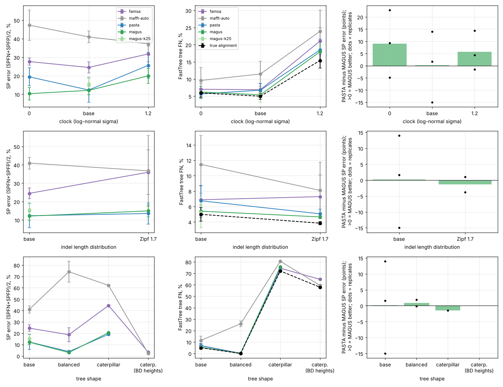

# Pilot: do MSA method rankings depend on the simulator's model?

CS581 (Computational Phylogenetics, UIUC, Fall 2026) project pilot, 2026-10-10. About 4.5 h of
wall-clock on a 4-core / 15 GB machine. This is evidence for or against a 4-week project, not a
finished study. Branch `claude/cs581-models`. Everything is in `cs581/models/`:

- `code/`: simulator, method runner, aggregation.
- `results/`: per-replicate JSON, the summary table and plots.
- `results/prior_art.md`: the full literature review, with about 75 verified DOIs.

## 1. Questions and where they come from

| source | text |
|---|---|
| First-day lecture, "Open problems (and possible course projects)", statistical models of evolution | "New models of tree shape, sequence evolution"; "Evaluating methods under these new models" |
| `notes/CS581-project-suggestions.txt` (line 186) | "Evaluate the impact of violating the strict molecular clock on either multiple sequence alignment or phylogenetic tree estimation, especially when using statistical methods" |
| same file (line 122) | "Test Prank in comparison to MAFFT as evolutionary diameter and deviation from a clock increase" |
| "MSA results from data" deck, "Results so far" | "Dataset properties that impact accuracy: … Perhaps other things (gap length distribution, deviation from molecular clock?)"; "what's going on with the difference between results on biological and simulated datasets?" |
| MAGUS paper (via our rescoring in `experiments/validation/REPORT.md`) | MAGUS vs PASTA SP-error: ROSE 1000M2 9.8 vs 13.7 (−28%), RNASim-1000 9.6 vs 9.8 (−2%) |

**Pilot question.** Holding everything else at a ROSE-1000M2-like baseline, does the MAGUS-over-PASTA
gain, or the method ranking, change when we vary one model factor at a time:
(a) clock violation, (b) indel-length distribution, (c) tree shape?

## 2. Prior art (summary; details and DOIs in `results/prior_art.md`)

- **Simulators differ in many things at once.**
  - ROSE (Stoye et al. 1998, 10.1093/bioinformatics/14.2.157) is used for the SATé/PASTA/MAGUS 1000-taxon conditions. It uses geometric-like gap lengths and r8s birth-death trees with i.i.d. branch multipliers. The multiplier range is reportedly [0.5, 2], from a secondary source; this is unverified.
  - INDELible (Fletcher & Yang 2009, 10.1093/molbev/msp098).
  - RNASim (Guo et al. 2009, arXiv:0912.2326) uses selection on RNA folding energy.
  - AliSim (Ly-Trong et al. 2022, 10.1093/molbev/msac092) uses Zipf a=1.7 indels by default.
  - Nute & Warnow 2016 (10.1186/s12864-016-3101-8) tabulate the differences, e.g. RNASim average gap length is 3.1 vs 9.9–13.2 for ROSE M1/L1. So the 28%-vs-2% MAGUS gap has never been attributed to any single factor.
- **Real indel lengths are power-law, not geometric.**
  - Benner et al. 1993 report about L^−1.7.
  - Chang & Benner 2004 report L^−1.8.
  - Cartwright 2009 reports an exponent of 1.6–1.7.
  - Wygoda et al. 2024 find Zipf fits most empirical alignments.
  - Simulated alignments, AliSim included, are detectably unrealistic: Trost et al. 2024, 10.1093/molbev/msad277, report ≥0.93 classifier accuracy. Nobody tested whether this changes aligner rankings.
- **Clock / tree shape and MSA.**
  - Ogden & Rosenberg 2006 (10.1080/10635150500541730) is the closest design. They crossed pectinate / balanced / random trees with clock regimes, but only for ClustalW-era aligners on small trees. Alignment error hurt tree accuracy most on pectinate trees.
  - Nelesen et al. 2008 (10.1142/9789812776136_0004): the guide tree matters for downstream trees.
  - Löytynoja & Goldman 2008 (10.1126/science.1158395): progressive aligners over-align. PRANK was tested with the true tree as guide.
  - Liu & Warnow 2012 (10.1371/journal.pone.0033104): treelength methods.
  - Clock-violation recipes:
    - UCLN (Drummond et al. 2006, 10.1371/journal.pbio.0040088);
    - SimPhy rate modifiers (Mallo et al. 2016, 10.1093/sysbio/syv082; used in ASTRAL-II);
    - NELSI.
- **Benchmark-dependent rankings.**
  - BAli-Phy is best on simulated data but under-aligns on biological data (Nute, Saleh & Warnow 2019, 10.1093/sysbio/syy068).
  - Benchmark critiques: Iantorno et al. 2014 (10.1007/978-1-62703-646-7_4), Blackshields et al. 2006, Edgar 2010 (10.1093/nar/gkp1196).
  - DNN tree methods win only under narrow simulation regimes (Zaharias et al. 2022, 10.1089/cmb.2021.0383).
  - Nuin et al. 2006 (10.1186/1471-2105-7-471) found that **indel size matters less than indel count** (small protein alignments).
- **Gap.** No study varies clock deviation, indel-length distribution and tree shape as controlled
  factors for modern large-scale aligners (MAGUS, PASTA, MAFFT, FAMSA, TWILIGHT). No DTM / PASTA / MAGUS paper has a caterpillar-vs-balanced experiment.

## 3. Simulation design

**Simulator.** `code/simulate.py` builds a model tree, then calls AliSim (IQ-TREE 3.1.4):
- Substitution model: HKY (κ=2, base frequencies .3/.2/.2/.3), no Γ.
- Root length 1000.
- Insertion rate = deletion rate.
- Indel lengths either geometric or truncated Zipf.

The tree is an ultrametric topology with node heights, then clock violation is added:
- Each branch is multiplied by an i.i.d. log-normal rate exp(N(−σ²/2, σ²)), which has mean 1. This is uncorrelated lineage-specific rate heterogeneity, i.e. UCLN-style clock violation.
- The tree is then rescaled to a fixed mean root-to-tip distance H.
- Replicate r uses seed 100+r in every cell, so the clock cells share their birth-death topology and node heights (paired design).

**Matching ROSE 1000M2** (`code/characterize.py`):
- Measured on ROSE 1000M2 R0/R1: mean p-distance 0.69, gap fraction 0.75–0.77, true-alignment length 4068–4340, about 300 gap runs per sequence with mean length 10.4–11.0. Root-to-tip CV of the ROSE model trees is 0.12–0.17, so ROSE M2 is itself mildly non-clock.
- At n=1000, AliSim with H=1.4–1.5, indel rate 0.004 and geometric mean length 8–9 reproduces these statistics: length 3714, p 0.67, 296 runs per sequence, mean run 9.2.
- **Matching summary statistics did not match difficulty.**
  - On the matched AliSim condition at n=500, MAGUS had 17.3% SP error, FAMSA 40.4% and MAFFT --auto 72.6% (one replicate).
  - On ROSE 1000M2, MAGUS has 9.8% and PASTA 13.7% (published alignments, rescored). Our FAMSA run on ROSE 1000M2 R0 gives 43.7% and MAFFT --auto (FFT-NS-2) gives 99.0%.
  - The same summary statistics therefore give different absolute errors and different gaps between methods. That is a small simulator-dependence result in itself.
- At n=250 the matched height is far harder still: MAGUS 40%, PASTA 45%, MAFFT L-INS-i 47%, FAMSA 57%. With fewer taxa, nearest-neighbour distances are longer.
- I therefore lowered H to **1.1** so that error sits in the 1000M2 range (MAGUS ≈ 10–12%). Baseline mean p is 0.63 and gap fraction 0.40.
- Error is a steep function of H near this point. At n=250, FAMSA gets 1.2% at H=0.6, 17% at H=0.9 and 57% at H=1.5.

**Factors** (one at a time from the baseline; n = 250 taxa; `code/driver.py`):

| axis | baseline | levels run |
|---|---|---|
| (a) clock violation σ | 0.3 (root-to-tip CV 0.10, close to ROSE's 0.12–0.17) | 0 (strict clock), 1.2 (CV 0.49) |
| (b) indel length | geometric, mean 9, rate 0.004 | truncated Zipf a=1.7 (max 200), rate 0.00536. Same indel volume (rate × mean = 0.036). a=1.7 is the empirical exponent from Benner 1993 / Cartwright 2009 and the AliSim default; it was not refit by us. |
| (c) tree shape | birth–death (λ=1, μ=0.5; coalescent point process) | perfectly balanced; caterpillar with evenly spaced node heights |

Defined but not run because of time: σ=0.7 and 2.0, Zipf a=1.5.

**Replicates: fewer than the ≥5 asked for.**
- 3 replicates each for base, clock0, clock1.2.
- 2 each for pow1.7 and balanced.
- 1 for caterpillar.

At n=250 one replicate costs about 16 min of 4-core time (MAGUS + PASTA). The grid ran as two workers with 2 threads each.

**Methods** (`code/run_methods.py`):
- **PASTA 1.8.3**: defaults, 3 iterations, the command from `gcmx/e2e_bench.py`.
- **MAGUS(Fast)**: the paper's flags, with the decomposition scaled to n=250: 10 subsets (`--maxnumsubsets 10`, i.e. 25 sequences per subset) and backbone size `-m 80`. This keeps the paper's 8 sequences per subset per backbone. A check with the literal paper flags (K=25, `-m 200`), `magus-k25`, was run on two base replicates.
- **MAFFT 7.505**: `--auto`.
- **FAMSA 2.4.1**: the fast new aligner.
- **MAFFT L-INS-i**: run only in the n=250, H=1.5 timing test (113 s); dropped from the grid for time.
- **TWILIGHT**: not run, because it needs an external guide tree.

**Scoring.**
- Alignment error: FastSP (`gcmx/score.py`), reported as (SPFN+SPFP)/2.
- Tree error: FastTree `-nt -gtr` on each alignment and on the true alignment, with FN rate against the model tree.

## 4. Results

`results/summary.md` and `results/summary.json` hold per-cell means ± SE; per-replicate rows are in `results/results.csv` and the raw outputs in `results/runs/`.



*Rows: clock, indel length, tree shape. Columns: alignment SP error, FastTree FN, and PASTA−MAGUS SP error per replicate (dots).*

| cell | reps | rtt CV | mean p | gap frac | famsa SP err | mafft-auto SP err | mafft-linsi SP err | pasta SP err | magus SP err | magus-k25 SP err | PASTA−MAGUS pts ±SE (rel, ratio of means) | famsa tree FN | mafft-auto tree FN | mafft-linsi tree FN | pasta tree FN | magus tree FN | magus-k25 tree FN | true tree FN | ranking (SP err) |
|---|---|---|---|---|---|---|---|---|---|---|---|---|---|---|---|---|---|---|---|--|
| clock0 | 3 | 0.00 | 0.64 | 0.40 | 27.7±2.0 | 47.3±8.2 | – | 19.4±4.8 | 10.3±3.4 | – | +9.1±8.0 (+47%) | 7.0±1.7 | 9.6±3.8 | – | 5.7±1.4 | 6.2±1.7 | – | 5.9±1.2 | magus < pasta < famsa < mafft-auto |
| base | 3 | 0.10 | 0.63 | 0.40 | 24.5±2.9 | 41.0±3.2 | – | 12.3±6.6 | 12.1±2.3 | 15.5±3.9 | +0.2±8.4 (+2%) | 6.9±1.8 | 11.5±3.7 | – | 6.7±2.0 | 5.4±0.8 | 5.3±2.0 | 5.0±0.9 | magus < pasta < magus-k25 < famsa < mafft-auto |
| clock1.2 | 3 | 0.49 | 0.61 | 0.43 | 31.8±4.3 | 37.2±4.7 | – | 25.6±7.0 | 19.9±4.1 | – | +5.7±4.6 (+22%) | 21.1±3.9 | 23.9±6.2 | – | 18.5±3.2 | 17.9±2.9 | – | 15.4±2.2 | magus < pasta < famsa < mafft-auto |
| pow1.7 | 2 | 0.10 | 0.63 | 0.45 | 36.0±12.1 | 36.7±19.2 | – | 13.5±5.7 | 14.9±3.3 | – | -1.4±2.4 (-10%) | 7.3±2.8 | 8.1±3.6 | – | 5.1±0.6 | 4.7±0.2 | – | 3.8±0.2 | pasta < magus < famsa < mafft-auto |
| balanced | 2 | 0.11 | 0.67 | 0.57 | 18.7±6.2 | 74.2±9.2 | – | 3.8±0.6 | 3.0±0.5 | – | +0.8±1.0 (+22%) | 0.2±0.2 | 25.9±2.4 | – | 0.0±0.0 | 0.0±0.0 | – | 0.0±0.0 | magus < pasta < famsa < mafft-auto |
| caterpillar | 1 | 0.19 | 0.60 | 0.70 | 44.4±0.0 | 62.1±0.0 | – | 19.0±0.0 | 20.5±0.0 | – | -1.5±0.0 (-8%) | 74.5±0.0 | 80.6±0.0 | – | 72.9±0.0 | 75.7±0.0 | – | 72.1±0.0 | pasta < magus < famsa < mafft-auto |
| caterpillarbdh | 1 | 0.05 | 0.27 | 0.35 | 3.3±0.0 | 2.2±0.0 | – | – | – | – | – | 64.8±0.0 | 59.5±0.0 | – | – | – | – | 57.9±0.0 | mafft-auto < famsa |

Per-replicate MAGUS vs PASTA SP error (%), showing why the cell means are unstable:

| cell | rep 0 | rep 1 | rep 2 |
|---|---|---|---|
| clock0 (σ=0) | MAGUS 8.3 / PASTA 17.5 | 17.0 / 12.2 | 5.8 / 28.6 |
| base (σ=0.3) | 16.7 / **1.7** | 10.4 / 24.4 | 9.2 / 10.8 |
| clock1.2 | 23.1 / 21.5 | 11.8 / 16.1 | 24.9 / 39.2 |
| pow1.7 (Zipf) | 11.7 / 7.8 | 18.2 / 19.3 | – |
| balanced | 3.5 / 3.3 | 2.5 / 4.4 | – |
| caterpillar | 20.5 / 19.0 | – | – |
| base, MAGUS with paper flags (K=25, -m 200) | 19.4 | 11.6 | – |

### What the data say (and do not say)

1. **The MAGUS-vs-PASTA comparison is dominated by replicate-to-replicate variance, not by the factors.**
   - Within one cell the PASTA−MAGUS difference ranges from −15 to +23 points.
   - Across cells, the mean difference ranges from −1.5 to +9.1 points, with SEs of 2–8 points.
   - The sign flips within base, clock0 and clock1.2. In one base replicate PASTA gets 1.7% against MAGUS's 16.7%.
   - PASTA's error on the *same* topology and node heights (clock cells, same rep) is not consistent: rep 0 gives 17.5 / 1.7 / 21.5. So the variance is not just "some trees are hard". It looks like run-level instability in PASTA's iterations, MAGUS's decomposition, or both.
   - I did not test whether the methods are deterministic on a fixed input. That is the first thing a project would have to do.
   - Using the paper's literal MAGUS flags did not help (19.4 and 11.6 vs 16.7 and 10.4), so the reversal is not caused by my scaled-down flags.
   - **At 2–3 replicates we cannot say whether the MAGUS gain changes along any axis.**
   - Taking the means at face value: the gain is largest under a strict clock (+9.1 ± 8.0 points, i.e. 47% of PASTA's error). It is +5.7 ± 4.6 (22%) at σ=1.2 and about zero at the ROSE-like σ=0.3. For Zipf indels it is −1.4 ± 2.4, and on the caterpillar −1.5 (one replicate). This pattern is not monotone and is within noise.
   - The SD of the paired PASTA−MAGUS difference over the 14 replicates is about 10 points. Detecting a 5-point change in the gain between two cells at 2 SE would need about 30 replicates per cell.
2. **The coarse ranking is robust; the top of the ranking is not.**
   - {MAGUS, PASTA} < FAMSA < MAFFT --auto holds in every cell's mean.
   - FAMSA vs MAFFT --auto flips in individual replicates (clock1.2 rep 0, pow1.7 rep 0).
   - PASTA beats MAGUS in 6 of the 14 paired replicates.
   - MAFFT --auto (FFT-NS-2 at this size) collapses on balanced trees (74% error, 26% tree FN), where every other method is below 19%.
3. **Clock violation mostly hurts tree estimation, and it amplifies the tree cost of alignment error.**
   - From σ=0 to σ=1.2, FastTree FN on the *true* alignment rises from 5.9% to 15.4%.
   - Alignment SP error rises moderately: MAGUS 10.3 → 19.9, PASTA 19.4 → 25.6, FAMSA 27.7 → 31.8.
   - The extra tree error from using an estimated alignment instead of the true one grows:
     - FAMSA: +1.1 → +5.7 points;
     - MAGUS: +0.3 → +2.5;
     - PASTA: −0.2 → +3.1.

   This agrees with Ogden & Rosenberg 2006 (alignment error matters more for trees on harder, non-clock trees). It is the most consistent signal in the pilot, but it rests on 3 replicates.
4. **Indel length (Zipf vs geometric, same indel volume).**
   - MAGUS and PASTA barely move: 14.9 / 13.5 vs 12.1 / 12.3.
   - FAMSA and MAFFT --auto become much more variable: FAMSA 23.9 and 48.1 in the two replicates, vs 24.5 ± 2.9 at baseline.
   - Two replicates are too few to conclude anything beyond "no large effect on the divide-and-conquer methods". This matches Nuin et al. 2006 (indel size matters less than indel count).
5. **Tree shape is confounded with branch-length distribution, which is a design problem.**
   - **Caterpillar with birth–death node heights** (first attempt, `caterpillarbdh`): most spine branches are about 0, so the true-alignment tree FN is 58% and alignment is trivial (FAMSA 3.3%).
   - **Caterpillar with evenly spaced heights:** spine branches are about 0.004 subs/site under long pendant edges, so the tree is still unresolvable (true-alignment FN 72%). Alignment is hard (FAMSA 44%, MAGUS 20.5, PASTA 19.0), and MAGUS took 23 min.
   - **Balanced tree** at the same mean root-to-tip distance: much easier for everything except MAFFT --auto (MAGUS 3.0, PASTA 3.8, tree FN 0%).
   - Fixing the mean root-to-tip distance is not a neutral normalization across shapes. A real tree-shape study needs something like Aldous' β with fixed pairwise-distance distribution, or must report shape and divergence jointly.
6. **Runtime** (2 threads, two jobs sharing 4 cores; medians over non-caterpillar replicates):
   - FAMSA: 8 s.
   - MAFFT --auto: 24 s.
   - PASTA: 466 s.
   - MAGUS: 504 s, or 1628 s with the paper's K=25 / `-m 200` at n=250.
   - FAMSA is about 60× faster than MAGUS/PASTA but has about 2× their SP error. Its trees are only 0.8–1.5 FN points worse than MAGUS's at σ≤0.3, and 3.2 points worse at σ=1.2.

## 5. Verdict

**Unclear, leaning not promising as scoped here. A narrower version is promising.**

- **Against.** The question "do MAGUS-over-PASTA gains depend on the simulator's model?" cannot be answered at 3 replicates. The run-level variance of the two divide-and-conquer methods (±10–15 SP-error points on single replicates near the twilight zone) is larger than any factor effect we saw. At about 16 min of 4-core time per replicate for MAGUS + PASTA at n=250, the roughly 30 replicates per cell needed for an 8-cell design come to about 60 machine-hours. That is feasible on a campus cluster, but it is the whole project budget, and the answer may still be "no detectable effect".
- **For.**
  1. Matching ROSE's summary statistics with AliSim did *not* reproduce ROSE's difficulty or the method gaps. That is a concrete, reportable observation about simulator dependence.
  2. The clock-violation axis gives a consistent signal on the *tree* side: alignment error costs more tree accuracy as σ grows. This is cheap to study with fast aligners (FAMSA, MAFFT) and many replicates.
  3. The PASTA/MAGUS instability is itself a finding worth one experiment: rerun the same input with different seeds.

**What a 4-week project could look like** (recommended narrower version):

- **Week 1.**
  - Quantify run-to-run variance of PASTA and MAGUS on fixed inputs (5 seeds × 5 datasets).
  - Fix the tree-shape normalization: Aldous β ∈ {−1.5 (caterpillar-like), −1 (empirical), 0 (Yule), +10 (balanced)}, holding the mean pairwise distance fixed.
- **Week 2.** Clock axis σ ∈ {0, 0.3, 0.7, 1.2} × 30 replicates at n=200–250:
  - FAMSA, MAFFT (--auto and L-INS-i) and TWILIGHT, cheap: about 2 machine-hours;
  - MAGUS and PASTA, on a cluster: about 30 machine-hours.
- **Week 3.**
  - Indel axis (geometric / Zipf 1.7 / Zipf 1.5 at fixed volume).
  - A "simulator swap" control: ROSE vs AliSim vs INDELible on the *same* model trees, which isolates the simulator from the tree.
- **Week 4.** Analysis (mixed models or paired tests, Kendall τ of rankings per cell) and write-up.
- **Headline deliverable:** tree error attributable to alignment error, as a function of clock violation, for fast vs divide-and-conquer aligners.

**Risks.**
1. Method instability swamps factor effects; this already happened in the pilot.
2. Confounding: every factor also changes divergence. Fixing mean root-to-tip distance vs mean pairwise distance gives different answers (the caterpillar results).
3. Compute: MAGUS/PASTA at 1000 taxa take 20–30+ min each on 4 cores, so the ROSE-sized setting needs a cluster.
4. The result may be "rankings are stable". That is a legitimate but less exciting outcome.

**Caveats in this pilot.**
- Fewer replicates than requested.
- No Γ rate heterogeneity across sites.
- n=250 rather than 1000.
- MAGUS settings scaled from the paper's.
- Runtimes measured with two jobs sharing the machine.
- MAFFT L-INS-i and TWILIGHT were not in the grid.
- The PASTA/MAGUS nondeterminism hypothesis is untested.
- The side check of FAMSA / MAFFT --auto on the real ROSE 1000M2 and RNASim-1000 data finished only for ROSE 1000M2 R0 (`results/real_sims_fast.jsonl`). FAMSA ran out of memory on RNASim (13.7 GB). A retry with U→T and a memory cap then failed in FastSP's JVM. So the planned ROSE-vs-RNASim ranking comparison for FAMSA is missing.

## 6. Reproduce

```bash
bash cs581/code/setup.sh
cd cs581/models/code
python3 driver.py /tmp/sims --n 250 --reps 3 --k 10 --bb 80 --threads 2 \
  --cells base,clock0,clock1.2,pow1.7,balanced,caterpillar   # run 2 copies to share the queue
python3 aggregate.py /tmp/sims ../results
```

