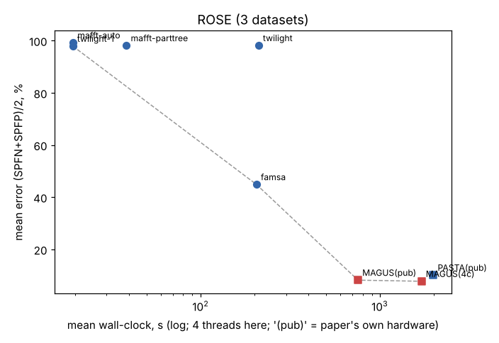
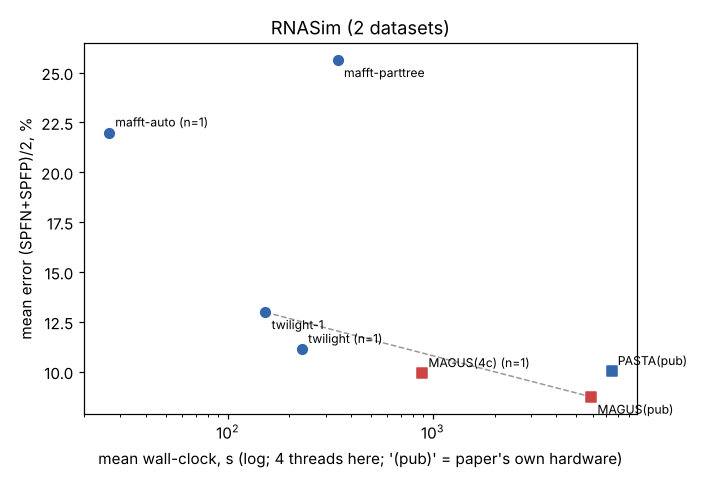
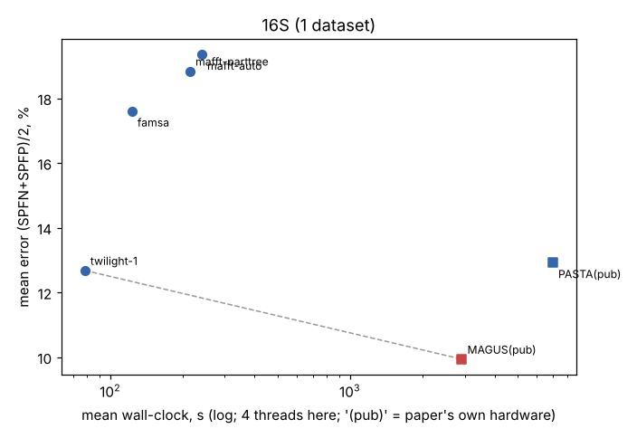
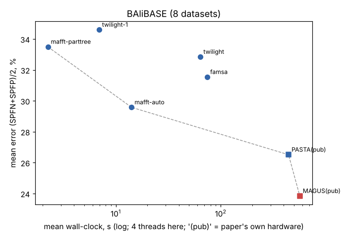

# Is MAGUS still state of the art, and is "MAGUS with a better base method" a good 4-week project?

*CS581 project-idea pilot, 2026-10-10. Branch `claude/cs581-sota2026`. Code in `code/`, raw results in `results/`.
About 4.5 hours of wall-clock on one 4-core / 15 GB cloud machine. Every number below was measured in this session,
except where it says "published", which means FastSP rescoring of the MAGUS paper's own output alignments
(`../experiments/validation/published_scores.jsonl`).*

## Summary

- **MAGUS is still the most accurate method on its own benchmarks.** Every aligner tested (TWILIGHT 0.2.3,
  FAMSA 2.4.1, MAFFT `--auto`/PartTree, plus L-INS-i, MUSCLE5 and Clustal Omega where feasible) loses to it on every
  one of 20 datasets.
  - On high-rate ROSE DNA the fast tools collapse: FAMSA is 25 points worse, and MAFFT FFT-NS-2/PartTree and
    TWILIGHT are about 80 points worse (97–99% error on 8 of 10 conditions).
  - On RNASim and 16S.T, TWILIGHT is 1.5–2.8 points worse but 4–37× faster: it is the speed end of the Pareto front.
- **No newer aligner beats MAFFT L-INS-i on MAGUS-sized nucleotide subsets.** G-INS-i ties; MUSCLE5 ties at 12× the
  cost; FAMSA, TWILIGHT and Clustal Omega lose by 3–35 points. Swapping G-INS-i into MAGUS changes nothing (−0.06).
- **Unexpected lead, proteins only.** Aligning MAGUS's *backbones* with Clustal Omega instead of L-INS-i lowered
  MAGUS's BAliBASE error by 1.6–1.9 points (5/5 sets, up to 3.0), mostly through fewer false positives. It had no
  effect on RNASim.
- **Verdict.** "MAGUS with a better base method" is not worth 4 weeks for nucleotides; a negative result is likely.
  Reframed as "which base method should build MAGUS's backbones and subsets on proteins", it is a cheap, promising
  4-week project. The harness is ready, and week 1 can confirm or kill the effect.

## 1. Questions

1. On MAGUS's own benchmarks, is MAGUS (Smirnov & Warnow 2021) still the best accuracy/runtime trade-off against
   aligners published since? Candidates: TWILIGHT (2025), FAMSA 2, MUSCLE5/Super5, Clustal Omega, MAFFT
   (`--auto`, PartTree, L-INS-i) and learnMSA2.
2. On MAGUS-sized subsets (about 40 and 200 sequences), is any of them more accurate than MAFFT L-INS-i? This is the
   instructor's suggested first step for "study MAGUS with different base methods".
3. (Added, because the harness made it cheap.) If a candidate swaps in for L-INS-i inside MAGUS, does MAGUS's
   final alignment improve?

## 2. Prior art (details and DOIs: `prior_art.md`)

- **No independent 2023–2026 benchmark exists.** No paper runs TWILIGHT, FAMSA2, Muscle5, Clustal Omega and the MAFFT
  modes against MAGUS, PASTA or UPP2 on MAGUS's nucleotide suite (ROSE 1000, RNASim, CRW 16S). Every nucleotide
  comparison was run by the method's own developers.
- **TWILIGHT** (Tseng et al., *Bioinformatics* 2025, doi:10.1093/bioinformatics/btaf212) is the only post-2023 paper
  that compares a fast tool with MAGUS on nucleotides, and only on RNASim (10k–1M) and AliSim.
  - At 10k sequences, MAGUS and Muscle5 are about 8% error. TWILIGHT reaches 6.5% at 1M sequences in 32 CPU-minutes.
  - On AliSim long-branch data, MAGUS is best (8.3% vs about 9%).
  - Competitors were given the *true* tree. There is no ROSE, CRW or BAliBASE.
- **FAMSA2** (Nat Biotechnol 2026, doi:10.1038/s41587-026-03095-3) and **learnMSA2** (Bioinformatics 2024,
  doi:10.1093/bioinformatics/btae381) are protein-only.
  - learnMSA2 "supports only protein alignments". On CPU with language-model embeddings it takes about 3 h per
    HomFam family (about 16× MAGUS).
  - Neither paper compares against MAGUS on nucleotides.
- **Muscle5** (Nat Commun 2022, doi:10.1038/s41467-022-34630-w) has no nucleotide benchmark beyond small Bralibase
  RNA sets and no MAGUS comparison.
- **UPP2** (2023, doi:10.1093/bioinformatics/btad007) is the broadest nucleotide comparison: UPP2 ≈ MAGUS are best on
  ROSE and large 16S, and Clustal Omega is worst. It used MUSCLE 3.8, not 5.
- **Base-method swaps exist only for PASTA, not MAGUS.**
  - PASTA with BAli-Phy subsets (Nute & Warnow 2016, doi:10.1186/s12864-016-3101-8) has the best TC everywhere at
    roughly 24 h/subset.
  - PASTA with ProbCons or G-INS-i subsets has been tested on BAliBASE only (Collins & Warnow 2018,
    doi:10.1093/bioinformatics/bty495).
  - Beating L-INS-i on ≤ 200 nucleotide sequences has only been shown for BAli-Phy with a fixed tree (Gupta et al.
    2021, doi:10.1093/bioinformatics/btab555).

## 3. Data and methods

**Data.** All from the MAGUS paper (Illinois Data Bank IDB-2643961):

| set | replicates used | sequences | notes |
|---|---|---|---|
| ROSE 1000 L1–L3, M1–M4, S1–S3 | R0 of each of the 10 conditions | 1000 | simulated DNA, ~1000 nt; random pairs are near saturation (median p-distance 0.69–0.70 on L1/L2/M2) |
| RNASim 1000 | R0 | 1000 | simulated RNA, ~1500 nt |
| CRW 16S.T | R0 | 5,548 | large, biological, length-filtered reference |
| BAliBASE RV100 (8 sets) | – | 195–732 | protein, length-filtered references (`../data/balibase_clean`) |

**Tools** (4 threads, wall-clock per run, nothing else heavy running except where noted):
- MAFFT 7.505 (`--auto`; PartTree `--retree 2 --parttree`; L-INS-i, plus G-INS-i and E-INS-i on subsets).
- Clustal Omega 1.2.4; MUSCLE 5.3 (`-align`; Super5); FAMSA 2.4.1.
- TWILIGHT 0.2.3 (`code/twilight_iter.py`).
  - TWILIGHT 0.2.3's CLI needs a guide tree. I re-implemented its official Snakemake iterative mode:
    a PartTree initial tree, TWILIGHT, then FastTree on the alignment with ≥ 95%-gap columns masked, then TWILIGHT
    again; 3 iterations, the workflow default.
  - DIPPER, the workflow's default tree tool, is not installed. "twilight-1" is one iteration on the PartTree tree.
- learnMSA2 was not run: it is protein-only, and on CPU its own paper reports about 3 h per family.
- Scoring: FastSP against the reference; error = (SPFN+SPFP)/2.

**MAGUS reference points.**
- *MAGUS(pub)*: the authors' published MAGUS(Fast) alignment of the same replicate, rescored. Its runtime is the
  paper's own (different hardware).
- *MAGUS(4c)*: earlier reruns of MAGUS(Fast) with the paper's flags on this same 4-core machine type
  (`../experiments/runs/<rep>/prep.json`; 5 of the 8 BAliBASE sets; 16S.T and 1000M1 not available).
- I did **not** rerun MAGUS fresh in this session. At 15–35 min per 1000-sequence dataset (and over 1 h for 16S.T) it
  did not fit the budget next to the other runs. The 4c measurements and two dedicated idle-machine timing sessions
  (1000L3_R0: 1857 s, 1000S2_R0: 969 s, BBA0101: 798 s; branches `cs581-timing-a/b`) give MAGUS's cost on this
  hardware.

**Statistics.**
- Paired by replicate: mean Δerror in points, W/T/L with a ±0.05 tie band, Wilcoxon signed-rank p.
- With one replicate per ROSE condition, "paired by replicate" means paired across conditions.

**Subset test** (`code/subsets.py`):
- *magus40*: 2 of MAGUS's own 25 decomposition subsets per replicate (≈ 40 sequences, clade-like), from the cached
  MAGUS runs. 30 subsets over 15 replicates: 9 ROSE, RNASim, 16S.M and 4 BAliBASE.
- *bb200*: MAGUS's first 200-sequence backbone (8 random sequences per subset).
- *rand40*: 40 uniformly random sequences.
- Baseline: MAGUS's exact subset command (`mafft --localpair --maxiterate 1000 --ep 0.123`), rerun here. It
  reproduces MAGUS's cached subset alignments: 20 of 36 identical in score, the rest within 0.76 points (MAFFT 7.505
  here vs the 7.450 bundled with MAGUS).
- Subset jobs ran single-threaded.

**Merge pilot** (`code/merge_pilot.py`):
- For a replicate with a cached MAGUS run, realign MAGUS's 25 subsets with tool X.
- Keep MAGUS's own 10 L-INS-i backbones, run only the GCM merge (`gcmx.run_magus -s -b`, paper flags), and score.
- The control (MAGUS's own L-INS-i subsets) reproduces MAGUS(4c) exactly (e.g. BBA0067: 26.28 vs 26.28).

**Timing caveat.** To fit the budget, one or two single-threaded subset or merge jobs ran alongside the 4-thread
full-dataset runs from about 02:05 UTC onwards. Wall-clock for the fast tools is therefore an upper bound, perhaps
up to ~1.5× inflated. That matters little next to the 10–100× gaps to MAGUS.

## 4. Results

### 4.1 Full datasets (Question 1)

Full table with seconds: `results/full_table.md`. Error is (SPFN+SPFP)/2 in %. MAGUS = the published MAGUS(Fast)
alignment of the same replicate.

| data (n) | MAGUS | PASTA | best fast tool here | its error | its time vs MAGUS(4c) |
|---|---|---|---|---|---|
| ROSE 1000, 10 conditions | **6.6** mean | 8.7 | FAMSA | 31.1 mean (2.5–63.6) | ~6× faster (mean 225 s vs 1,404 s) |
| RNASim 1000 (1) | **9.6** | 10.1 | TWILIGHT, 3 iterations | 11.1 | 230 s vs 888 s |
| 16S.T, 5,548 seqs (1) | **9.9** | 12.9 | TWILIGHT, 1 iteration | 12.7 | 78 s vs 2,918 s (paper's hardware) |
| BAliBASE, 8 protein sets | **23.8** mean | 26.5 | MAFFT `--auto` | 29.6 mean | ~75× faster (mean 14 s vs 1,082 s) |

**Paired against MAGUS, same replicate** (Δ = tool − MAGUS in points; W/T/L = tool better/tie/worse; Wilcoxon):

| data | tool | n | mean Δ | W/T/L | p |
|---|---|---|---|---|---|
| ROSE | FAMSA | 10 | +24.5 | 0/0/10 | 0.002 |
| ROSE | TWILIGHT (1 it.) | 10 | +80.5 | 0/0/10 | 0.002 |
| ROSE | MAFFT `--auto` / PartTree | 10 | +80.4 / +80.5 | 0/0/10 | 0.002 |
| ROSE | PASTA (published) | 10 | +2.1 | 0/0/10 | 0.002 |
| BAliBASE | MAFFT `--auto` | 8 | +5.7 | 0/0/8 | 0.008 |
| BAliBASE | FAMSA / TWILIGHT (3 it.) | 8 | +7.7 / +9.0 | 0/0/8 | 0.008 |
| all 20 | every fast tool | 12–20 | +16.5 to +45 | 0 wins | < 0.001 |
| all | MAGUS(4c) rerun vs published MAGUS | 15 | +0.3 | 2/2/11 | 0.06 |

Pareto fronts (mean error vs mean wall-clock, log x): `results/pareto_ROSE.png`, `pareto_RNASim.png`,
`pareto_16S.png`, `pareto_BAliBASE.png`. On every data type MAGUS is the accuracy end of the front. Nothing tested
is both faster and as accurate.

 
 

**What stands out**

1. **On high-rate ROSE, every fast progressive aligner collapses.**
   - MAFFT FFT-NS-2 (`--auto` at this size), PartTree and TWILIGHT score **97–99% error** on 8 of the 10 conditions.
     The exceptions are M3 (72–88%) and the easy M4 (3–6%).
   - This is not a scoring bug. The same FastSP harness reproduces the published MAGUS and PASTA numbers to 0.1
     points.
   - Under the *true* alignment, random sequence pairs in L1/L2/M2 differ at 69–70% of aligned sites, close to the
     75% saturation level for DNA. Even the most similar pairs differ at about 43%.
   - On a 100-sequence subset I checked one pair: under the true alignment it has only 28.5% identity, and MAFFT's
     wrong alignment scores *higher* (30.9%) than the true one.
   - k-mer guide trees are random at this divergence. MAFFT `--nofft` is just as bad, so FFT anchoring is not the
     cause.
   - FAMSA, with its LCS-based distances, degrades less (13–64%). Accuracy here comes only from tree-aware
     divide-and-conquer with dense sampling (MAGUS, PASTA).
2. **Guide-tree diagnostic (true tree as guide tree).** Given the true tree, TWILIGHT reaches about 29% on 1000L1
   (vs 98% with its own PartTree start) and FAMSA about 16% (vs 33%); MAGUS has 8%. So the tree causes most of the
   collapse, but even a perfect tree leaves single-pass progressive alignment 2–4× worse than MAGUS on this data.
   - Over the 10 ROSE conditions: FAMSA 31.1% → 14.2% with the true tree, TWILIGHT about 87% → 23.1%; MAGUS 6.6%.
   - On RNASim, TWILIGHT with the true tree reaches 10.1%, equal to PASTA and 0.5 points behind MAGUS.
   - See the diagnostic table in `results/full_table.md`.
3. **On RNASim and 16S, TWILIGHT is the only real competitor.**
   - It is 1.5–2.8 points worse than MAGUS but 4–37× faster. On 16S.T it roughly ties PASTA (12.7 vs 12.9).
   - On RNASim 1000, 3 iterations take 230 s for 11.1%, and 1 iteration takes 21 s for 14.4%.
   - The 3-iteration TWILIGHT rerun on 16S.T (after the wrapper fix) did not finish within the budget; only the
     1-iteration number is reported.
   - This matches the TWILIGHT paper: MAGUS stays a bit more accurate at ≤10k sequences; TWILIGHT wins on scale.
4. **FAMSA 2.4.1 is unreliable on nucleotides.** It ran out of memory (>13.5 GB) on RNASim 1000, scored +31 points
   on RNASim subsets and is 25 points behind MAGUS on ROSE. Its paper is protein-only.
5. **On BAliBASE, MAGUS beats every fast tool on all 8 sets**, by 3–21 points.
   - MAFFT L-INS-i on the full set ties MAGUS on BBA0067 (26.1 vs 25.6) and BBA0101 (29.3 vs 28.5), and is 10
     points worse on BBA0081 (67.4 vs 57.0). It takes 6–10 min each.
   - MUSCLE5 did not finish BBA0067 (274 sequences) or BBA0081 (195) in 15 min each.
6. **Not run, or not usable.**
   - MUSCLE5 `-align` did not finish 100 sequences sampled from 1000M2 within its 10-min cap, and Super5 was still
     running when I stopped it at 4 min. Both are impractical at 1000 long nucleotide sequences on 4 cores.
   - Clustal Omega took more than 9 min on 1000L1 and was dropped from the full-dataset runs. It is covered at the
     subset level and in the merge pilot.
   - learnMSA2 is protein-only and too slow on CPU (by its own paper).

### 4.2 Subsets (Question 2): is anything more accurate than MAFFT L-INS-i?

From `results/subset_table.md`. Δ = tool − L-INS-i in points; negative means more accurate than L-INS-i.

| subsets | tool | n | mean err | mean Δ | W/T/L | p | s/subset (1 core) |
|---|---|---|---|---|---|---|---|
| MAGUS's own (~40) | **L-INS-i** (MAGUS's command) | 30 | 6.2 | 0 | – | – | 8 |
| | G-INS-i | 30 | 6.2 | −0.05 | 8/12/10 | 0.72 | 8 |
| | MAFFT `--auto` | 30 | 6.5 | +0.26 | 2/17/11 | 0.004 | 9 |
| | MUSCLE5 | 16 | 9.3 | +0.76 | 6/2/8 | 0.27 | 96 |
| | E-INS-i | 30 | 8.1 | +1.88 | 4/9/17 | 0.0007 | 10 |
| | Clustal Omega | 30 | 9.5 | +3.28 | 5/0/25 | 7e-6 | 3 |
| | FAMSA | 30 | 16.6 | +10.4 | 1/1/28 | 9e-9 | 2 |
| | TWILIGHT (3 it. / 1 it.) | 30 | 28.2 / 31.3 | +22.0 / +25.0 | ≤2 wins | 4e-9 | 7 / 2 |
| random 40 | G-INS-i | 16 | 29.3 | +1.65 | 10/0/6 | 0.9 | 24 |
| | MAFFT `--auto` | 16 | 34.0 | +6.4 | 6/1/9 | 0.12 | 28 |
| | Clustal / FAMSA / TWILIGHT | 16 | 55–65 | +27 to +37 | ≤1 win | <1e-4 | 2–11 |
| MAGUS backbone (200) | G-INS-i | 6 | 22.6 | +0.31 | 4/0/2 | 1.0 | 438 |
| | Clustal / FAMSA / TWILIGHT | 6 | 55–61 | +32 to +38 | 0 wins | 0.03 | 51–84 |

By data type on MAGUS's own subsets (mean Δ vs L-INS-i):

| tool | ROSE (18) | RNASim (2) | 16S.M (2) | BAliBASE (8) |
|---|---|---|---|---|
| G-INS-i | −0.06 | −0.14 | −0.02 | −0.00 |
| MUSCLE5 | +3.25 (n=4) | **−0.67** | −0.00 | +0.06 |
| Clustal Omega | +5.12 | +0.54 | +3.41 | **−0.20** |
| FAMSA | +13.2 | +31.7 | +0.17 | +1.19 |
| TWILIGHT (3 it.) | +34.7 | +0.88 | +0.43 | +3.92 |

**Answer: none of the newer methods is more accurate than MAFFT L-INS-i on nucleotide subsets of MAGUS's sizes.**
- Only G-INS-i (also MAFFT, same era) ties.
- MUSCLE5 ties overall, with hints of gains on RNASim (n=2), and is about 12× slower.
- The modern fast tools (TWILIGHT, FAMSA) are tuned for speed and lose 10–35 points at this size and divergence.
- On proteins, MUSCLE5 and Clustal Omega tie L-INS-i at the subset level.

### 4.3 Merge pilot: does swapping MAGUS's base method change MAGUS? (`results/merge_table.md`)

Same decomposition and same backbones. Only the 25 subset alignments change.

| data | base method | reps | mean Δ final error vs MAGUS | better/tie/worse |
|---|---|---|---|---|
| BAliBASE | MUSCLE5 | 5 | **−0.48** | 4/0/1 |
| BAliBASE | Clustal Omega | 5 | **−0.33** | 5/0/0 |
| BAliBASE | G-INS-i | 5 | +0.03 | 1/2/2 |
| nucleotide (RNASim, 16S.M, ROSE L3/M2/S1) | G-INS-i | 5 | −0.06 | 2/2/1 |
| **BAliBASE** | **Clustal Omega, subsets + backbones** | 5 | **−1.89** | **5/0/0** |
| BAliBASE | Clustal Omega, backbones only (L-INS-i subsets) | 5 | −1.62 | 5/0/0 |
| nucleotide control (RNASim) | Clustal Omega, backbones only | 1 | −0.06 | tie (9.92 → 9.86) |

Per replicate, MAGUS's error in % before → after Clustal Omega subsets and backbones:

| set | before | after |
|---|---|---|
| BBA0039 | 4.69 | 4.24 |
| BBA0067 | 26.28 | 24.86 |
| BBA0101 | 29.19 | 26.39 |
| BBA0154 | 21.66 | 18.70 |
| BBA0190 | 23.40 | 21.59 |

For reference, the published MAGUS/PASTA numbers are 4.5/4.3, 25.6/25.7, 28.5/29.2, 21.1/22.5 and 23.1/23.9.

- **Subsets alone change little.**
  - G-INS-i is noise: ±0.2 points on both protein and nucleotide data.
  - MUSCLE5 and Clustal Omega subsets give a small gain on proteins (−0.3 to −0.5).
- **The backbones are what matter on proteins.**
  - Aligning MAGUS's 10 backbones with Clustal Omega instead of L-INS-i lowers final error by 1.4–3.0 points on 4 of
    5 sets (0.45 on the easy BBA0039).
  - With backbones alone (subsets kept as L-INS-i) the drop is 0.25–2.83 points, mean −1.62, on 5 of 5 sets. It beats both MAGUS and PASTA as published on every set but BBA0039, where it
    is 0.07 behind PASTA.
  - The gain is almost all in SPFP, down 3–5 points with SPFN unchanged. Clustal's backbones give GCM fewer wrong
    edges.
  - This happens although the Clustal backbone alignment is *not* more accurate on its own: BBA0101 backbone,
    31.4% vs 31.1% for L-INS-i.
  - It is also faster: Clustal aligns a 200-sequence protein backbone in about 14 s vs about 190 s for L-INS-i on
    1 core.
- **The effect looks protein-specific.** On RNASim the same backbone swap changes MAGUS by −0.06 points (n = 1),
  and Clustal is 32 points worse than L-INS-i on nucleotide backbones (subset test). The 16S.M control did not finish.
- The control reproduces MAGUS exactly. These are single MAGUS runs per set (n = 5) on data where MAGUS's own
  run-to-run noise is about 0.5 points, so the −1.9 mean (5/5) is a strong lead but not yet a result.

## 5. Verdict

**Is MAGUS still state of the art on its own benchmarks? Yes, for accuracy.**
- Across 20 datasets (10 ROSE conditions, RNASim, 16S.T, 8 BAliBASE), no aligner released since 2021 that runs on
  a 4-core CPU is as accurate. Every fast tool loses on every dataset (0 wins in 12–20 pairs, p < 0.001).
- On high-rate simulated DNA (ROSE) the gap is enormous (+25 to +80 points); the fast tools collapse.
- MAGUS is no longer the best *trade-off* everywhere:
  - On RNASim and 16S, TWILIGHT gives up 1.5–3 points for a 4–37× speed-up.
  - On easy data (1000M4) every tool is within 5 points.
  - At ≥ 100k sequences the literature favours TWILIGHT outright.
- This agrees with the earlier literature verdict (`../literature/sota_review.md`) and adds the first independent
  ROSE and CRW numbers for TWILIGHT and FAMSA.

**Is "MAGUS with a better base method" worth 4 weeks? Yes, but reframed: for proteins, and about the backbones.
For nucleotides, no.**
- **Nucleotides: no.** The instructor's first step ("find methods more accurate than MAGUS and MAFFT-L-INS-i")
  finds none among the newer methods.
  - At subset level, TWILIGHT, FAMSA and Clustal Omega are much worse than L-INS-i; MUSCLE5 ties at about 12× the
    cost; G-INS-i ties.
  - Swapping G-INS-i into MAGUS moves it by noise (−0.06 points over 5 replicates).
  - The only method published to beat L-INS-i at this size is BAli-Phy (Gupta et al. 2021), at hours per subset. Its
    PASTA analogue was published in 2016.
  - A nucleotide-only project would most likely report a negative result.
- **Proteins: a strong, cheap lead.**
  - On subsets, Clustal Omega and MUSCLE5 only tie L-INS-i.
  - But using Clustal Omega for MAGUS's **backbones** cut MAGUS's error on BAliBASE by 1.9 points on average (5/5
    sets, up to 3.0). This beats published MAGUS and PASTA on 4 of the 5 sets, and the backbones get cheaper.
  - The gain is in precision (SPFP), not in a more accurate backbone. That points to an interesting mechanism: what
    makes a good *evidence* alignment for GCM is not what makes a good final alignment.
- **Suggested 4-week project:** "Base methods for MAGUS on proteins: which aligner should build the backbones and the
  subsets?"
  - Base aligners: Clustal Omega, MUSCLE5 (`-perturb` ensembles), FAMSA, MAFFT G-INS-i and FFT-NS-2; learnMSA2 if a
    GPU is available.
  - Data: all 8 BAliBASE sets × several MAGUS seeds, plus HomFam, where MAGUS's protein claims were made.
  - Measure: SPFN, SPFP, the MWT-AM score and runtime, and test whether the effect holds at 1k–10k sequences.
  - The harness exists: `code/merge_pilot.py` takes about 1 min per replicate with cached decompositions;
    `--backbones tool` and `--subsets cached` isolate each component.
  - Week 1 would confirm or kill the effect: more seeds, all BAliBASE sets, and nucleotide controls.
- **Other ideas found along the way:**
  - (a) "Why do fast aligners collapse on high-rate simulated DNA?" The true-tree diagnostic shows the guide tree
    explains about half of FAMSA's gap and most of TWILIGHT's.
  - (b) The merge-step ideas in `../literature/sota_review.md`, unaffected by these findings.

## 6. Risks and caveats

- **One replicate per condition.**
  - ROSE results are paired across 10 conditions, not across replicates. RNASim and 16S.T have n = 1. On RNASim 10K, only TWILIGHT (1 iteration) finished before the budget ran out: 11.5% error in 285 s, against 8.3% for published MAGUS (mean of 10 replicates). MAFFT PartTree got 27.6% in 629 s.
  - The gaps are 10–80 points, so this barely matters for Question 1. It does matter for the 0.3–0.5-point merge
    results (n = 5).
- **MAGUS runtimes are not fresh.**
  - They come from earlier 4-core runs on the same machine type (`prep.json`; these vary 2× between replicates,
    e.g. RNASim 888 s vs 4,375 s), two idle-machine timing sessions, and the paper.
  - MAGUS was not rerun in this session.
- **Contention.** Fast-tool times are upper bounds: one or two single-threaded jobs ran alongside after about 02:05.
  FAMSA's times on ROSE vary 48–773 s, partly for this reason.
- **TWILIGHT configuration.**
  - The workflow was re-implemented with PartTree instead of DIPPER for the initial tree. TWILIGHT's own Table 1 shows
    PartTree trees cost it about 4 points on RNASim.
  - Default scoring parameters were used. A tuned TWILIGHT, or a DIPPER/MAFFT-tree start, might do better.
  - A wrapper bug (16S's IUPAC codes were read as protein, so FastTree ran with a protein model) was found and
    fixed. The 16S.T 3-iteration run was redone.
- **MUSCLE5** was tested only at subset level and on small BAliBASE sets, because it is too slow on 1000 long
  nucleotide sequences on 4 cores.
- **Subset choice.** magus40 subsets are only 2 of 25 per replicate. The merge pilot realigns all 25.
- **The protein backbone result rests on 5 BAliBASE sets with one MAGUS decomposition and backbone draw each.**
  - The other 3 sets have no cached MAGUS run.
  - It could be BAliBASE-specific: the RV100 sets are small, 195–732 sequences, so 200-sequence backbones cover much
    of the data.
  - It was not tested with MUSCLE5 backbones, which were too slow here, or at HomFam scale.
- **Merge-pilot bug, found and fixed.** MAFFT writes DNA in lower case and GCM matches letters case-sensitively. The
  first nucleotide merges (about 50% error) were discarded and rerun after upper-casing.
- **learnMSA2, Super5 and regressive T-Coffee** were not evaluated.

## Files

- `prior_art.md`: literature check with DOIs.
- `code/bench.py`, `tools.py`, `twilight_iter.py`: full-dataset runner (restartable).
- `code/subsets.py`, `code/merge_pilot.py`: subset test and base-method swap.
- `code/analyze.py`: tables and plots.
- `results/full.jsonl`, `subsets.jsonl`, `merge_pilot.jsonl`: raw rows.
- `results/*_table.md`: tables.
- `results/pareto_*.png`: plots.
